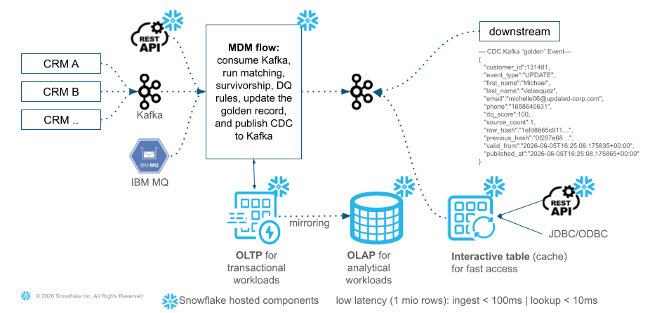
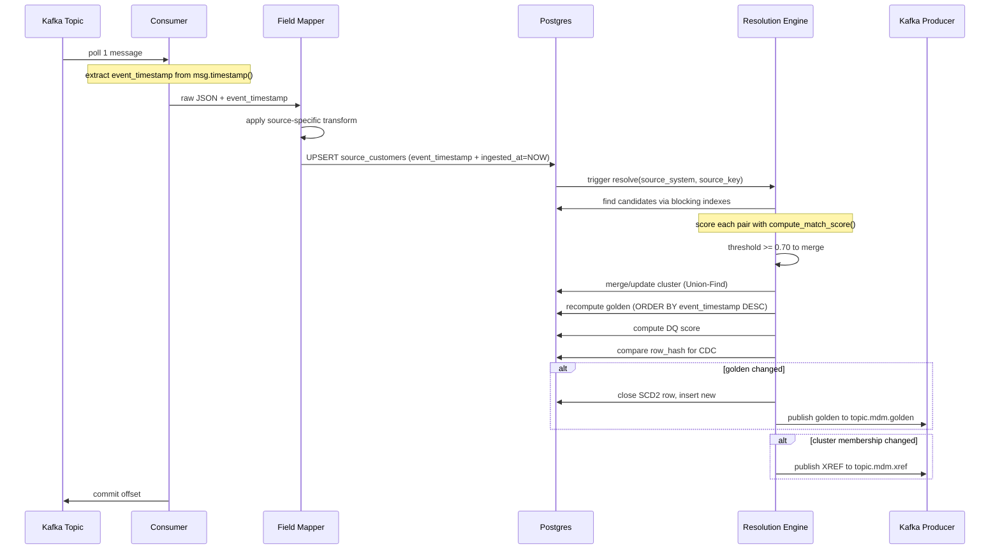

# MDM Spec - Near-Real-Time: Snowflake - Postgres + Kafka

## Marcel Däppen | Principal Solutions Engineer | Snowflake | EMEA Growth Markets

Version 2026-06-12

## Context

The current Snowflake MDM pipeline runs as batch (TARGET_LAG = 24h). This design replicates the fuzzy matching, survivorship, and DQ logic in Postgres for sub-second golden record updates, with Kafka as the event bus using **single-message processing** (one record processed at a time, with cluster-local recomputation and conditional golden publish).

### Architectural overview




### Source Field Mappings

| CRM_A raw fields | CRM_B raw fields | CRM_C raw fields |
|---|---|---|
| `src_customer_id` | `customer_key` | `ticket_customer_id` |
| `first_name` | `name` (full name) | `caller_name` (full name) |
| `last_name` | (split from name) | (split from caller_name) |
| `email` | `email_address` | `callback_email` |
| `phone` | `mobile` | `callback_phone` |

---

## Scope and MVP Boundaries

**In scope (Phase 1 / MVP):**
- Customer matching only (name, email, phone)
- Deterministic + probabilistic rules (D01, D02, C01, P01, P03, P04)
- No address-based matching in scoring (MATCH-P02 and MATCH-P05 deferred to Phase 2)
- No deletes/tombstones (insert/update CDC only)
- No ML models -- rule-based only
- Single consumer instance
- Docker Desktop local testing
- At-least-once processing with idempotent UPSERTs

**Out of scope / Phase 2:**
- Address pipeline (BIZ-13) -- address survivorship, address DQ, address golden records
- Address-based match scoring (MATCH-P02 street JW, MATCH-P05 phone+city)
- Delete/tombstone event handling
- Schema registry / Avro serialization
- Multi-region deployment
- Production HA/failover for Postgres
- ML-based matching or active learning

---

## Glossary

| Term | Definition |
|------|-----------|
| `source_key` | Primary key from the originating CRM system (e.g., `src_customer_id` in CRM_A) |
| `cluster_id` | Auto-incremented ID grouping matched source records. One cluster = one real-world entity. **Note:** `customer_id` is an alias for `cluster_id` used in outbound events and XREF -- they always hold the same value. Schema uses `cluster_id` internally and `customer_id` in external-facing contracts (outbound Kafka, Snowflake tables, XREF). |
| `customer_id` | Alias for `cluster_id` in external-facing contexts (outbound events, XREF, Snowflake). Always equals `cluster_id`. |
| `golden record` | The single current best-version of a cluster, after survivorship rules are applied |
| `current row` | The golden record row with `is_current=TRUE` (`valid_to = '9999-12-31'`) |
| `history row` | A closed golden record version with `is_current=FALSE` |
| `event_timestamp` | When the source system changed the record (from Kafka message timestamp) |
| `ingested_at` | When the MDM engine received and processed the record (Postgres `NOW()`) |

---

## Assumptions and Constraints

- Source systems provide reliable Kafka timestamps (`CreateTime`) reflecting when the change actually occurred
- Source keys (`src_customer_id`, `customer_key`, `ticket_customer_id`) are immutable -- a key is never reused for a different entity
- Message ordering is only guaranteed per partition/key -- cross-partition ordering is not assumed
- Source systems publish inserts and updates only (no deletes in MVP)
- Each source system has a stable schema -- field names do not change without consumer redeployment
- Snowflake Managed Postgres provides standard PostgreSQL wire protocol and DDL compatibility

---

## Requirements Summary

### Business Requirements (BIZ)

| ID | Title | Status |
|----|-------|--------|
| BIZ-01 | Kafka Inbound Topics | Done |
| BIZ-02 | Single-Message Consumer | Done |
| BIZ-03 | Incremental Resolution | Done |
| BIZ-04 | Blocking Indexes | Done |
| BIZ-05 | Rule-Based Matching | Done |
| BIZ-06 | Transitive Cluster Management | Done |
| BIZ-07 | Survivorship Recomputation | Done |
| BIZ-08 | DQ Scoring | Done |
| BIZ-09 | Kafka Outbound (CDC) | Done |
| BIZ-10 | Batch Re-Resolution | Done |
| BIZ-11 | SCD2 History | Done |
| BIZ-12 | XREF Table | Done |
| BIZ-13 | Address Pipeline | Planned (Phase 2) |
| BIZ-14 | REST API (inbound + synchronous CDC response) | Done |
| BIZ-15 | Cluster Split / Unmatch (fix-forward with CDC) | Done |

### Infrastructure Requirements (INF)

| ID | Title | Status |
|----|-------|--------|
| INF-01 | Kafka Container (local dev/test) | Done |
| INF-01b | Kafka on Confluent Cloud (production) | Planned |
| INF-02 | Postgres Container (local dev/test) | Done |
| INF-02b | Snowflake Managed Postgres (production) | Planned |
| INF-03 | MDM Engine Container (local dev/test) | Done |
| INF-03b | MDM Engine on SPCS (production) | Planned |
| INF-04 | Local Docker Desktop Dev Environment | Done |
| INF-05 | Throughput Target | Done (~100ms at 1M records) |
| INF-06 | Snowflake Interactive Table | Planned |
| INF-07 | Snowflake Table Mirroring via Managed Postgres (SCD2 + XREF + Audit) | Planned |
| INF-08 | HA: Kafka Multi-Broker Cluster | Planned (Phase 2) |
| INF-09 | HA: Postgres Replication & Failover | Planned (Phase 2) |
| INF-10 | HA: MDM Engine Multi-Instance (active-active) | Planned (Phase 2) |

### Security Requirements (SEC)

| ID | Title | Status |
|----|-------|--------|
| SEC-01 | Transport Security (TLS/mTLS) | Planned (Phase 2) |
| SEC-02 | API Authentication & Authorization (JWT/OAuth2) | Planned (Phase 2) |
| SEC-03 | Multi-Tenant Data Isolation (RLS) | Planned (Phase 2) |
| SEC-04 | Audit Logging (Postgres + Snowflake immutable) | Partially Done (Postgres layer) |
| SEC-05 | Secrets Management (Vault/SPCS Secrets) | Planned (Phase 2) |
| SEC-06 | Data Encryption at Rest | Planned (Phase 2) |

### Observability Requirements (OBS)

| ID | Title | Status |
|----|-------|--------|
| OBS-01 | OpenTelemetry Instrumentation (traces, metrics, logs) | Planned (Phase 2) |

### Deployment & Operations Requirements (DEP)

| ID | Title | Status |
|----|-------|--------|
| DEP-01 | CI/CD Pipeline (build, test, deploy) | Planned (Phase 2) |
| DEP-02 | Container Image Registry & Vulnerability Scanning | Planned (Phase 2) |
| DEP-03 | Zero-Downtime Deployment (blue/green or rolling) | Planned (Phase 2) |
| DEP-04 | Rollback Strategy & Canary Releases | Planned (Phase 2) |
| DEP-05 | Infrastructure-as-Code (reproducible environments) | Planned (Phase 2) |

### Testing Requirements (TST)

| ID | Title | Status |
|----|-------|--------|
| TST-01 | Synthetic Event Producer (Faker) | Done |
| TST-02 | E2E Integration Test Script | Done |
| TST-03 | Streamlit Golden Record Viewer | Done |
| TST-04 | Production-Scale Load Test (1M customers) | Done (infra ready) |
| TST-05 | Full-Path Regression Suite (config-driven) | Done |

---

## Environment Configuration

| Setting | Local (Docker) | CI | Production |
|---------|---------------|-----|-----------|
| Kafka partitions | 1 | 3 | 3+ |
| Kafka replication | 1 | 1 | 3 |
| Postgres | `postgres:16-alpine` container | Snowflake Managed Postgres | Snowflake Managed Postgres |
| MDM Engine | Docker container | SPCS (Snowpark Container Services) | SPCS (Snowpark Container Services) |
| Consumer instances | 1 | 1 | 1-3 (per partition) |
| Topic retention | 1 day | 1 day | 7 days |

---

## Processing Guarantees

**Delivery semantics:** At-least-once processing.

**Database state idempotency:** All DB operations are idempotent by design:
- UPSERT uses `ON CONFLICT ... DO UPDATE` with `WHERE event_timestamp <= EXCLUDED.event_timestamp` -- same message processed twice produces identical DB state
- Cluster assignment is deterministic (same matches = same cluster)
- Golden record is recomputed from source data (not incremented) -- reprocessing produces identical output

**Outbound event duplication:** Kafka outbound uses idempotent producer (`enable.idempotence=true`), but in failure/retry scenarios, duplicate outbound messages may still occur (same `customer_id` + `row_hash`). **Downstream consumers (Snowflake, dashboards) must tolerate duplicate events** by deduplicating on `(customer_id, row_hash)` or treating repeated events as no-ops.

**Transaction boundary:** A single Postgres transaction encompasses:
1. Source UPSERT
2. Cluster update (Union-Find merge)
3. XREF update
4. Golden record recomputation
5. SCD2 close/open

Kafka publish happens **after** transaction commit. If publish fails, the consumer does not commit the Kafka offset and retries on next poll. This means the entire DB transaction may execute again on reprocessing -- this is expected and safe because all operations are deterministic and idempotent (same input = same DB state).

---

## Failure Handling

| Scenario | Behavior |
|----------|----------|
| Malformed JSON payload | Log error, skip message, commit offset, increment `errors_skipped` counter |
| Unknown topic / unregistered mapper | Log error, skip message, commit offset |
| Postgres connection lost | Retry with exponential backoff (3 attempts), then crash and let orchestrator restart |
| Kafka publish fails after DB commit | Retry produce (idempotent producer handles duplicates). On persistent failure, log to DLQ topic `topic.mdm.dlq` |
| Duplicate message delivery | No-op -- UPSERT is idempotent, golden recomputation is deterministic |
| Out-of-order message | UPSERT `WHERE` clause rejects older events -- no overwrite, no error |
| Consumer crash mid-processing | Message not committed -- reprocessed on restart (at-least-once) |
| Deletes / tombstones | **Not supported in MVP.** Null-value messages are skipped with a warning log |

---

## Observability

| Metric | Source | Purpose |
|--------|--------|---------|
| `messages_processed_total` | Consumer | Total inbound messages processed (by topic) |
| `messages_skipped_total` | Consumer | Malformed/unparseable messages skipped |
| `upsert_duration_ms` | UPSERT | Postgres write latency per message |
| `resolution_duration_ms` | Resolver | Full resolution cycle time (blocking + scoring + cluster + golden) |
| `golden_published_total` | Producer | Golden record changes published to outbound |
| `golden_noop_total` | CDC | Recomputations that produced no change (row_hash unchanged) |
| `cluster_merges_total` | Cluster Manager | Number of cluster merge events |
| `dlq_messages_total` | Producer | Messages sent to DLQ after persistent publish failure |
| `consumer_lag` | Kafka | Consumer group lag (messages behind head) |
| `source_to_ingest_latency_ms` | `ingested_at - event_timestamp` | Time from source change to MDM ingest (includes network + queue) |
| `engine_processing_ms` | Application timer | Local processing time (UPSERT + resolve + publish) |
| `source_to_publish_latency_ms` | Application telemetry | Full end-to-end: source change to golden published on Kafka |

**Logging:** Structured JSON logs with `source_system`, `source_key`, `cluster_id`, `event_type` for traceability.

**DLQ:** `topic.mdm.dlq` receives messages that failed Kafka outbound publish after 3 retries. Includes original golden payload + error reason. Note: malformed inbound messages are logged and skipped (not sent to DLQ) because they cannot be meaningfully reprocessed without source-side fixes.

---

## Business Requirements Detail

### BIZ-01: Kafka Inbound Topics

**Status:** Done

**What:** Each CRM source (A, B, C) publishes change events to its own dedicated Kafka topic. Messages are JSON with source-specific field names. The message key is the source primary key to ensure partition affinity (all updates for one record go to the same partition, preserving order).

**How:**
- 3 Kafka topics: `topic.crm.a`, `topic.crm.b`, `topic.crm.c`
- Configuration: see Environment Configuration table for partitions/replication per environment
- Each CRM publishes CDC events (insert/update) using Kafka `CreateTime` timestamp
- Message key = source primary key (e.g., `src_customer_id` for CRM_A)
- Message value = JSON payload with source-specific field names

**Acceptance criteria:** Messages published to any of the 3 topics are consumed and correctly mapped into `source_customers` with all blocking keys populated.

### BIZ-02: Single-Message Consumer

**Status:** Done

**What:** A Python consumer polls one message at a time from any of the 3 topics, applies the source-specific field mapper to normalize it into the common schema (`SourceCustomer` dataclass), and UPSERTs into the Postgres `source_customers` table. The target SLA is: Kafka message received to Postgres row committed < 100ms.

**How:**
- Library: `confluent-kafka` Consumer with `enable.auto.commit=false`
- Processing model: single-message (poll one, process one, commit one)
- Field mapping: topic-to-mapper dispatch (`TOPIC_MAPPER` dict)
- Postgres writes: `psycopg3` with prepared statements for low-latency
- Offset commit: manual, only after successful UPSERT + resolution
- Timestamp extraction: `msg.timestamp()` provides `event_timestamp`
- Out-of-order protection: UPSERT includes `WHERE event_timestamp <= EXCLUDED.event_timestamp`

**Functional acceptance:** A message with an older `event_timestamp` than the existing row does NOT overwrite it. **Performance target (benchmark):** Message received to row committed < 100ms under controlled conditions.

### BIZ-03: Incremental Resolution

**Status:** Done (infrastructure ready, pending full 1M validation run)

**What:** On each UPSERT, only the incoming record is resolved against existing candidates -- not a full N x N re-computation. This limits work to O(block_size) comparisons per message, enabling sub-second latency even as the dataset grows.

**How:**
- After UPSERT, call `resolve(source_system, source_key)`
- Resolution queries candidates via blocking indexes (BIZ-04)
- Scores each candidate pair (BIZ-05)
- Updates cluster membership (BIZ-06)
- Recomputes golden record for affected cluster only (BIZ-07)
- Typical candidate set size: 10-50 records (not thousands)

**Functional acceptance:** A new record matching an existing record is assigned to the same cluster. **Performance target (benchmark):** Resolution completes in < 50ms for a dataset of 2,000 source records.

### BIZ-04: Blocking Indexes

**Status:** Done

**What:** Pre-computed blocking keys stored as indexed columns on `source_customers`. Candidate lookup queries these indexes to avoid full table scans. Any record sharing at least one blocking key with the incoming record becomes a candidate for pairwise scoring.

**How:**
- 3 blocking keys computed at ingest time:
  - `block_soundex` = `jellyfish.soundex(last_name)` (4-char code)
  - `block_email_domain` = substring from `@` onward (e.g., `@acme.com`)
  - `block_phone_suffix` = last 4 digits of phone number
- Postgres B-tree indexes: `idx_block_soundex`, `idx_block_email`, `idx_block_phone`
- Query uses OR across all three with IS NOT NULL guards
- Typical block size: 10-50 records per blocking key value

**Functional acceptance:** A record sharing a blocking key with an existing record appears in the candidate set. **Performance target (benchmark):** Candidate lookup executes in < 10ms with 2,000 source records.

### BIZ-05: Rule-Based Matching

**Status:** Done

**What:** Pairwise scoring of the incoming record against each candidate. Uses deterministic rules (high confidence, exact matches) and probabilistic rules (fuzzy string similarity). The final score combines both: `MAX(deterministic) + SUM(probabilistic)`. If the combined score >= 0.70, the records are considered a match. There is **no machine learning model** -- this is a classical approach using the `jellyfish` library for Jaro-Winkler similarity (~1 microsecond per comparison).

**How:**
- Deterministic rules (take the MAX):
  - MATCH-D01: Email exact equality = 1.00
  - MATCH-D02: Phone last-10 digits equality = 0.95
  - MATCH-C01: Canonical name exact (case-insensitive) = 0.80
- Probabilistic rules (SUM all that fire):
  - MATCH-P01: Full name Jaro-Winkler >= 0.85 = jw * 0.30
  - MATCH-P03: Last name SOUNDEX equality = 0.20
  - MATCH-P04: Email domain match + first name JW >= 0.90 = 0.15
  - ~~MATCH-P02: Address street JW + postal exact = 0.25~~ **(Phase 2)**
  - ~~MATCH-P05: Phone last-7 + same city = 0.10~~ **(Phase 2)**
- Formula (MVP): `final = MAX(D01, D02, C01) + P01 + P03 + P04`
- Threshold: `>= 0.70` triggers a merge
- Library: `jellyfish.jaro_winkler_similarity()` for JW, `jellyfish.soundex()` for SOUNDEX

**Acceptance criteria:** Known matching pairs from the batch pipeline (Bill/William Smith, same email) produce scores >= 0.70. Known non-matches produce scores < 0.70.

### BIZ-06: Transitive Cluster Management

**Status:** Done

**What:** When record A matches record B, and B already matches C (in an existing cluster), all three must be in the same cluster. This requires transitive closure of match relationships. Uses a Union-Find (disjoint set) data structure for O(1) amortized merge operations.

**How:**
- `customer_clusters` table: `(source_system, source_key) -> cluster_id`
- `cluster_id` = `customer_id` (they are the same value)
- Union-Find with path compression in Python for in-memory operations
- On new match between records in different clusters:
  1. Identify smaller cluster (fewer members)
  2. UPDATE all records in smaller cluster to the larger cluster's ID
  3. Recompute golden for the merged cluster
- On new record joining existing cluster:
  1. INSERT into `customer_clusters` with existing `cluster_id`
  2. Recompute golden for that cluster
- On no match found:
  1. Create new cluster with `cluster_id = nextval('cluster_seq')`

**Acceptance criteria:** After merging two clusters, all source records in both original clusters point to the same `cluster_id`.

### BIZ-07: Survivorship Recomputation

**Status:** Done

**What:** When a cluster changes, recompute the golden record for that cluster only. Survivorship picks the best value per attribute from all source records in the cluster, using a priority ordering: (1) completeness, (2) source trust priority, (3) recency.

**How:**
- Query all source records in the affected cluster from `source_customers`
- For each attribute (first_name, last_name, email, phone), pick the best value:
  1. Completeness: non-null, valid format (e.g., email contains @, phone >= 7 digits)
  2. Source priority: CRM_A=1, CRM_B=2, CRM_C=3 (lower = higher trust)
  3. Recency: `event_timestamp DESC` (most recently changed at source wins)
- Compute `source_count = COUNT(DISTINCT source_system)` in cluster
- UPSERT result into `golden_customers`
- Typically touches 1-3 source records per cluster

**Acceptance criteria:** Given CRM_A (email=null) and CRM_B (email=valid), survivorship picks CRM_B's email regardless of source priority.

### BIZ-08: DQ Scoring

**Status:** Done

**What:** Apply the same non-AI data quality rules as the batch Snowflake pipeline on the newly computed golden record. AI-based rules (fake name detection) are excluded because sub-second latency leaves no room for model inference. Base score 100, penalties for issues, bonuses for completeness. Clamped 0-100.

**How:**
- Python function `compute_dq_score(golden) -> int`
- Rules (same as `DT_CUSTOMER_GOLDEN_FUZZY`):
  - DQ-001: Invalid email format = -20
  - DQ-002: Disposable email domain = -5
  - DQ-003: Missing/short first_name = -20
  - DQ-004: Special chars in first_name = -5
  - DQ-005: Missing/short last_name = -20
  - DQ-006: Special chars in last_name = -5
  - DQ-007: Invalid phone format = -5
  - DQ-008: Placeholder phone (0000000000, etc.) = -20
  - DQ-C01: No contact method (no valid email AND no valid phone) = -20
  - DQ-C02: No complete name (both first and last missing) = -20
  - DQ-X03: Name appears in email = +5
  - DQ-AI01: (skipped in NRT -- no AI fake detection)
- Formula: `GREATEST(0, LEAST(100, 100 + sum_of_penalties_and_bonuses))`

**Acceptance criteria:** A golden record with valid email, valid name, valid phone produces DQ score >= 95. A record with no email and no phone produces DQ score <= 60.

### BIZ-09: Kafka Outbound (CDC)

**Status:** Done

**What:** After golden record recomputation, compare the SHA2 row hash with the previous version. If changed, publish the new golden record to `topic.mdm.golden`. XREF changes are published to a separate `topic.mdm.xref` topic. Only actual changes trigger a publish.

**How:**
- Compute `row_hash = SHA256(first_name|last_name|email|phone|dq_score)`
- Compare with `previous_hash` stored in `golden_customers`
- If different (or first time): publish to `topic.mdm.golden`
- On cluster membership change (new source record added, cluster merge): publish XREF update to `topic.mdm.xref`
- Library: `confluent-kafka` Producer with `acks=all`, `enable.idempotence=true`
- Message key per topic:
  - `topic.mdm.golden`: `customer_id` (partition affinity for golden record consumers)
  - `topic.mdm.xref`: `source_system|source_key` (partition affinity per source record)

**Outbound event contract:**
```json
{
  "customer_id": 42,
  "event_type": "UPDATE",
  "first_name": "William",
  "last_name": "Smith",
  "email": "bill@acme.com",
  "phone": "+11043321819",
  "dq_score": 95,
  "source_count": 2,
  "valid_from": "2026-06-04T10:32:15Z",
  "previous_valid_from": "2026-06-01T08:00:00Z",
  "row_hash": "a1b2c3...",
  "previous_hash": "d4e5f6...",
  "published_at": "2026-06-04T10:32:15.123Z"
}
```

**Acceptance criteria:** An unchanged golden record (same attributes after re-survivorship) produces NO outbound message.

**XREF outbound event contract** (`topic.mdm.xref`):
```json
{
  "source_system": "CRM_B",
  "source_key": "B001",
  "customer_id": 42,
  "event_type": "ASSIGN",
  "previous_customer_id": null,
  "published_at": "2026-06-04T10:32:15.123Z"
}
```

**Acceptance criteria:** XREF events published on cluster membership changes. Golden and XREF contracts are consumed by INF-06/INF-07 for Snowflake mirroring.

### BIZ-10: Batch Re-Resolution

**Status:** Done

**What:** On-demand full re-computation of all clusters from scratch. Used for consistency checks, rule change validation, initial bootstrap, or periodic reconciliation.

**How:**
- CLI command: `python -m nrt_mdm.batch_resolve`
- Steps:
  1. Truncate `customer_clusters` (cluster assignments reset)
  2. Close all current golden records: `UPDATE golden_customers SET is_current = FALSE, valid_to = NOW() WHERE is_current = TRUE` (history rows preserved)
  3. Iterate all records in `source_customers`
  4. Apply full blocking + matching + clustering globally
  5. Recompute all golden records with survivorship + DQ (inserts new `is_current = TRUE` rows)
  6. Publish all changes to Kafka outbound
- Note: SCD2 history is preserved (old rows remain with `is_current = FALSE`). Only cluster assignments and current golden rows are rebuilt.
- Expected runtime: ~1.6 seconds for 1,500 records (batch_resolve_fast)

**Acceptance criteria:** After batch re-resolution, golden record count and merge rate match the Snowflake FUZZY pipeline within +/- 1%.

### BIZ-11: SCD2 History

**Status:** Done

**What:** Golden records maintain full change history with `valid_from`, `valid_to`, `is_current` columns. Each change creates a new row (close previous, insert new). Enables point-in-time queries.

**How:**
- Database: **Postgres** (same instance as source/golden tables -- INF-02)
- On golden record change detected (row_hash differs):
  1. `UPDATE golden_customers SET valid_to = NOW(), is_current = FALSE WHERE cluster_id = :id AND is_current = TRUE`
  2. `INSERT INTO golden_customers (..., valid_from = NOW(), valid_to = '9999-12-31', is_current = TRUE)`
- Row hash: `SHA256(first_name|last_name|email|phone|dq_score)`
- Both operations in same Postgres transaction
- Index on `(cluster_id, is_current)` for fast current-record lookups
- Executed by MDM Engine (INF-03) as part of `resolve_and_publish()`

**Acceptance criteria:** After 3 updates to the same cluster, history table contains 3 rows: 2 with `is_current=FALSE` and 1 with `is_current=TRUE`.

### BIZ-12: XREF Table

**Status:** Done

**What:** Real-time cross-reference mapping every `(source_system, source_key)` pair to its golden `customer_id`. Updated atomically with cluster changes.

**How:**
- Table: `customer_xref (source_system, source_key, customer_id, created_at)`
- Updated in the same Postgres transaction as cluster merge/golden recomputation
- Indexed on both `(source_system, source_key)` and `(customer_id)`
- On cluster merge: UPDATE all xref rows in the absorbed cluster to new customer_id

**Acceptance criteria:** Every row in `source_customers` has exactly one corresponding row in `customer_xref`. XREF changes (new assignment, reassignment on cluster merge) emit events to `topic.mdm.xref`.

### BIZ-13: Address Pipeline (Phase 2)

**Status:** Planned (Phase 2) — `source_addresses` schema ready

**What:** Parallel address resolution alongside customer. Source addresses linked to customer clusters. Survivorship picks best address per customer. Address DQ scoring (DQ-011, DQ-012, DQ-X04). Note: address fields are NOT used in customer match scoring in MVP (see Phase 2 deferred rules).

**How:**
- `source_addresses` table DDL created for forward compatibility
- Full implementation pending:
  - Linked to customer clusters via: `source_customer_key -> customer_clusters.source_key`
  - On customer cluster change, recompute address golden:
    1. Find all source addresses for records in the cluster
    2. Apply address survivorship (completeness, priority, recency)
    3. Compute address DQ score (base 100, -5 short street, -20 null city, +10 complete)
    4. UPSERT into `golden_addresses`
  - Publishes address changes to `topic.mdm.golden.addresses`

**Acceptance criteria:** At most one current golden address per customer cluster. Customers with at least one source address have exactly one current golden address. Customers without source addresses have no golden address. Address DQ scores are between 0-100.

---

### BIZ-14: REST API (inbound + synchronous CDC response)

**Status:** Done

**What:** A REST API that accepts inbound customer events (same as Kafka topics) and returns the resulting CDC event synchronously in the response. This provides a request/response alternative to Kafka for sources that prefer HTTP. The event is processed through the full MDM pipeline (map -> UPSERT -> resolve -> survivorship -> DQ -> SCD2) and the golden record change (or no-change) is returned in the same HTTP call.

**How:**
- FastAPI service running alongside the MDM engine
- Endpoint:
  - `POST /api/v1/ingest/{source_system}` — accepts a customer event, processes it through the full pipeline, returns the CDC result
- Request body: same JSON schema as Kafka inbound messages
  ```json
  POST /api/v1/ingest/crm_a
  {"src_customer_id": "A000123", "first_name": "Bill", "last_name": "Smith", "email": "bill@acme.com", "phone": "+11043321819"}
  ```
- Response: the CDC event (golden record change) returned synchronously
  ```json
  {
    "customer_id": 42,
    "event_type": "UPDATE",
    "first_name": "Bill", "last_name": "Smith",
    "email": "bill@acme.com", "phone": "+11043321819",
    "dq_score": 100, "source_count": 3,
    "row_hash": "abc123...",
    "previous_hash": "def456...",
    "changed": true,
    "latency_ms": 55
  }
  ```
- If the golden record did not change (e.g., out-of-order event or survivorship picked existing value), response includes `"changed": false`
- The event is ALSO published to Kafka outbound topics (parallel delivery)
- Internally calls the same `process_message` pipeline functions
- Additional read endpoints:
  - `GET /api/v1/customers/{customer_id}` — current golden record
  - `GET /api/v1/customers/{customer_id}/sources` — source records in cluster
  - `GET /api/v1/customers/{customer_id}/history` — SCD2 history

**Acceptance criteria:** `POST /api/v1/ingest/crm_a` with a valid payload returns the CDC event in <200ms. The same change is also published to `topic.mdm.golden`.

---

### BIZ-15: Cluster Split / Unmatch (fix-forward with CDC)

**Status:** Done

**What:** A procedure to correct false-positive matches by splitting a cluster — removing one or more source records from a cluster they should not belong to, creating a new cluster for the unmatched records, recomputing golden records for both clusters, and publishing CDC events so all downstream systems reflect the correction.

**Why:** Matching is probabilistic. When the system incorrectly merges two distinct individuals into one cluster (e.g., father and son with same phone), a data steward must be able to reverse this without full re-resolution.

**How:**

1. **Trigger:** Admin API call or Streamlit UI action:
   ```
   POST /api/v1/admin/unmatch
   {
     "cluster_id": 42,
     "source_records_to_split": [
       {"source_system": "CRM_B", "source_key": "B00456"}
     ],
     "reason": "False positive: father/son share phone number"
   }
   ```

2. **Split procedure (single transaction):**
   - Validate: records exist in specified cluster
   - Create new cluster_id (from sequence) for the split-out records
   - UPDATE `customer_clusters` — reassign split records to new cluster
   - UPDATE `customer_xref` — update customer_id for split records
   - Recompute golden record for **original cluster** (fewer sources now)
   - Compute golden record for **new cluster** (the split-out records)
   - Compute DQ scores for both
   - SCD2 close + insert for both golden records
   - Commit

3. **CDC fix-forward (published after commit):**
   - `topic.mdm.golden`: UPDATE event for original cluster (changed source_count, possibly changed fields)
   - `topic.mdm.golden`: INSERT event for new cluster (new golden record)
   - `topic.mdm.xref`: REASSIGN events for each split record (old_customer_id → new_customer_id)
   - `topic.mdm.audit`: ADMIN event with full details (who, what, why, before/after)

4. **Block future re-merge:**
   - Store a "suppression" record: `(source_system_a, source_key_a, source_system_b, source_key_b)` — these two records must never be placed in the same cluster again
   - Resolver checks suppressions before merging: if a candidate pair is suppressed, skip the match even if score > threshold
   - Suppression table: `match_suppressions (id, source_system_a, source_key_a, source_system_b, source_key_b, reason, created_by, created_at)`

5. **Downstream impact:**
   - All consumers of `topic.mdm.golden` receive the correction via standard CDC
   - No special "unmatch" event type needed — just UPDATE + INSERT on golden topic
   - XREF REASSIGN events let consumers update their foreign keys
   - Snowflake mirrored tables auto-correct via Managed Postgres replication

**Example scenario:**
```
Before:  cluster=42 has [CRM_A|A001, CRM_B|B456, CRM_C|C789] → golden: "John Smith"
Action:  unmatch CRM_B|B456 from cluster 42
After:   cluster=42 has [CRM_A|A001, CRM_C|C789] → golden: "John Smith" (source_count=2)
         cluster=900001 has [CRM_B|B456] → golden: "John Smith Jr" (source_count=1)
CDC:     golden UPDATE cluster=42 (source_count 3→2)
         golden INSERT cluster=900001 (new golden record)
         xref REASSIGN CRM_B|B456 (customer_id 42→900001)
```

**Acceptance criteria:**
- After unmatch, the two clusters are independent — future events for the split records do not re-merge (suppression enforced)
- Both golden records are recomputed with correct survivorship
- CDC events published for both clusters (downstream systems converge to correct state)
- SCD2 history preserved (old golden row closed, new row opened for both clusters)
- Audit trail records: who performed the unmatch, which records, reason, before/after state
- Suppression survives batch re-resolution (re-resolve respects suppressions)

**Admin UI integration (Streamlit):**
- Integrated into the golden record viewer (port 8501) as an "Admin" page
- Workflow:
  1. Data steward searches for a customer (by ID or name)
  2. Views source records in the cluster — identifies the wrongly merged record
  3. Selects source record(s) to split out
  4. Enters reason (free text, required)
  5. Clicks "Unmatch" — triggers `POST /api/v1/admin/unmatch`
  6. UI shows confirmation: new cluster ID, updated golden records for both, CDC events published
- Access: requires `mdm:admin` role (SEC-02). Button hidden for `mdm:read` users.
- Suppression history viewable in audit viewer (port 8502) filtered by `event_type=ADMIN`

---

## Infrastructure Requirements Detail

### INF-01: Kafka Container

**Status:** Done

**What:** Kafka runs as a single-node container (KRaft mode, no ZooKeeper) for local dev and CI. Multi-platform image (linux/amd64 + linux/arm64).

**How:**
- Image: `apache/kafka:3.7.0` (KRaft mode, single-node)
- Ports: `9092` (internal plaintext), `9093` (controller), `19092` (external/host access)
- Environment: `KAFKA_PROCESS_ROLES=broker,controller`, `CLUSTER_ID` auto-generated
- Topics auto-created on first produce (or via init container)
- Volume: `/var/lib/kafka/data` for persistence across restarts
- Platform: `platform: linux/amd64,linux/arm64` in docker-compose
- Health check: `kafka-topics --bootstrap-server localhost:9092 --list` (from inside container)
- Note: replication-factor=1 locally, =3 in production (see Environment Configuration)

**Acceptance criteria:** `docker compose up kafka` starts and becomes healthy within 30 seconds.

### INF-02: Postgres Container / Snowflake Managed Postgres

**Status:** Done (local container)

**What:** Postgres hosts all MDM tables. Container for local/CI, Snowflake Managed Postgres for production (not SPCS). Same schema DDL works in both environments.

**How:**
- Local: `postgres:16-alpine` (multi-arch), port `5432`
- Init scripts: mount `schema/*.sql` into `/docker-entrypoint-initdb.d/`
- Volume: `/var/lib/postgresql/data` for persistence
- Health check: `pg_isready -U mdm`
- Extensions: none required (all string similarity runs in Python)
- **Production:** Snowflake Managed Postgres. Connection switches via `POSTGRES_DSN` env var. No container-specific features used.

**Acceptance criteria:** Schema DDL runs without modification on both `postgres:16` container and Snowflake Managed Postgres.

### INF-03: MDM Engine Container

**Status:** Done (local container)

**What:** A single Python container runs the entire MDM engine: Kafka consumer, field mapping, resolution, survivorship, DQ, and Kafka producer. All co-located for simplicity and low latency.

**How:**
- Base image: `python:3.13-slim` (multi-arch)
- Dependencies: `confluent-kafka`, `psycopg[binary]`, `jellyfish`
- Entrypoint: `python -m nrt_mdm.consumer`
- Environment: `KAFKA_BOOTSTRAP_SERVERS`, `POSTGRES_DSN`, `KAFKA_GROUP_ID`
- Stateless (all state in Postgres)
- Waits for Kafka + Postgres to be healthy before starting
- Scaling: run multiple replicas (one per Kafka partition) for higher throughput
- **Production:** Deployed as a SPCS (Snowpark Container Services) service in Snowflake. Same Docker image, pushed to Snowflake image registry. Connects to Snowflake Managed Postgres via internal networking. This is an explicit architectural decision: MDM Engine = SPCS, Postgres = Snowflake Managed Postgres, Kafka = external managed Kafka (e.g., Confluent Cloud).

**Acceptance criteria:** Container starts, connects to Kafka and Postgres, and begins processing within 10 seconds.

### INF-04: Local Docker Desktop Dev Environment

**Status:** Done

**What:** The entire stack runs locally with `docker compose up`. No cloud dependencies for development and testing.

**How:**
- `docker-compose.yml` defines: Kafka, Postgres, MDM Engine, test producer
- Single command: `docker compose up --build`
- Kafka UI: `provectuslabs/kafka-ui` on port `8080` for topic inspection
- **Startup seeding:** Test producer replays existing CSV files (1,500 records from batch pipeline) as Kafka events for bootstrap
- Postgres at `localhost:5432`, Kafka at `localhost:19092` (external port)
- `.env` file with default local credentials
- `docker compose --profile test up` starts the test producer (seeds 100 events). Full E2E tests run via `./nrt/tests/run_e2e.sh`.

**Acceptance criteria:** `docker compose up` produces golden records queryable in Postgres within 60 seconds of startup.

### INF-05: Throughput Target

**Status:** Done (~100ms at 1M records)

**What:** The system must meet different throughput targets depending on deployment configuration.

**MVP baseline (single consumer, 1 partition):**
- Target: 100-300 events/second sustained
- P99 latency: < 500ms per event
- Sufficient for development, testing, and low-volume production

**Scaled production (3 consumers, 3 partitions):**
- Target: 1,000 events/second sustained
- P99 latency: < 500ms per event
- Requires: 3 Kafka partitions, 3 consumer instances, connection pooling

**How:**
- Single-threaded consumer with prepared statements (baseline)
- Scale: multiple consumer instances (one per Kafka partition)
- Connection pooling: `psycopg_pool` (min=2, max=10)
- Benchmark: `kafka-producer-perf-test --throughput 1000`
- Target breakdown: UPSERT < 5ms, blocking < 10ms, scoring < 1ms/pair, survivorship < 5ms, golden write < 5ms

**Acceptance criteria (benchmark-scoped):** Under controlled benchmark conditions (Docker Desktop, warm caches), single consumer processes >= 100 events/second. With 3 consumers, aggregate throughput >= 1,000 events/second.

### INF-06: Snowflake Interactive Table

**Status:** Planned

**What:** Low-latency queryable table in Snowflake consuming `topic.mdm.golden`. Current-state only (latest golden record per customer). For real-time serving use cases.

**How:**
- Snowpipe Streaming SDK or Kafka Connector ingests from `topic.mdm.golden`
- Target: Snowflake Interactive Table with `TARGET_LAG = DOWNSTREAM`
- Schema: `(customer_id, first_name, last_name, email, phone, dq_score, source_count, last_updated)`
- Overwrites on each update (no history -- that's INF-07's job)

**Acceptance criteria:** A golden record change in Postgres is queryable in the Interactive Table within 5 seconds.

### INF-07: Snowflake Table Mirroring (SCD2 + XREF + Audit)

**Status:** Planned

**What:** Mirror full golden record history, XREF, and audit events into Snowflake tables for analytics, BI, reporting, and compliance. Uses Snowflake Managed Postgres built-in replication (not Kafka-based ingestion). Complements INF-06 (which only stores current state).

**How:**
- **Mechanism:** Snowflake Managed Postgres table mirroring — automatic replication of Postgres tables to Snowflake
- Postgres tables replicated to Snowflake OLAP tables:
  - `golden_customers` → `CRMA_NRT_TB_CUSTOMER_HISTORY` (full SCD2 append-only)
  - `golden_customers WHERE is_current = TRUE` → `CRMA_NRT_TB_CUSTOMER` (current golden, view or filtered mirror)
  - `customer_xref` → `CRMA_NRT_TB_XREF` (cross-reference)
  - `audit_events` → `MDM_AUDIT.EVENTS` (immutable audit trail for SEC-04 compliance, 7+ year retention)
  - `source_addresses` → `CRMA_NRT_TB_ADDRESSES` **(Phase 2 — populated when BIZ-13 is implemented)**
- Latency: near-real-time (seconds) — Snowflake Managed Postgres replication lag
- No additional Kafka topics or connectors required — mirroring is native to Snowflake Managed Postgres
- Snowflake-side `MDM_AUDIT.EVENTS`: NO UPDATE/DELETE grants, Time Travel = 90 days, Fail-safe = 7 days
- Schema matches batch pipeline DTs for compatibility
- Enables side-by-side comparison: batch vs NRT results

**Acceptance criteria:** After 10 golden record updates in Postgres, Snowflake mirrored table contains the same 10 rows within 5 seconds. Audit events in Snowflake cannot be modified or deleted by any role.

---

### INF-08: HA: Kafka Multi-Broker Cluster

**Status:** Planned (Phase 2)

**What:** Production Kafka deployment must tolerate broker failures without message loss or pipeline interruption. Applies to both inbound topics (CRM events) and outbound topics (CDC golden/xref).

**How:**
- Confluent Cloud: multi-AZ cluster with `replication.factor=3` and `min.insync.replicas=2`
- Topics configured with `acks=all` on producers (MDM engine + REST API)
- Consumer group rebalancing with `session.timeout.ms=30000` for graceful failover
- Dead-letter topic (`topic.mdm.dlq`) for poison messages that survive retries
- Monitoring: under-replicated partitions alert, consumer lag alert

**Acceptance criteria:** Single broker failure causes zero message loss. Consumer group rebalances within 30 seconds. No manual intervention required for single-broker failure.

---

### INF-09: HA: Postgres Replication & Failover

**Status:** Planned (Phase 2)

**What:** Production Postgres (Snowflake Managed Postgres or self-managed) must provide automatic failover with minimal data loss. The MDM engine's state (source_customers, golden records, clusters, XREF) is the system of record and must survive infrastructure failures.

**How:**
- **Snowflake Managed Postgres:** Built-in HA with synchronous replication across AZs. Automatic failover with RPO=0 (no data loss). MDM engine reconnects via DNS endpoint.
- Connection string uses a virtual/DNS endpoint that follows the primary
- MDM engine uses connection retry logic with exponential backoff (already implemented in `psycopg_pool`)
- WAL archiving to object storage for point-in-time recovery (PITR)

**Acceptance criteria:** Primary failure causes automatic failover within 30 seconds. RPO=0 (synchronous replication). MDM engine reconnects and resumes processing without manual intervention. No duplicate golden records produced during failover.

---

### INF-10: HA: MDM Engine Multi-Instance (active-active)

**Status:** Planned (Phase 2)

**What:** Multiple MDM engine instances process events in parallel for throughput and availability. If one instance fails, remaining instances absorb the load automatically.

**How:**
- Kafka consumer group with N instances (N ≥ 2). Kafka assigns partitions across instances.
- Each instance processes a subset of inbound partitions (partition-level parallelism)
- Cluster-level row locking in Postgres (`SELECT ... FOR UPDATE`) prevents concurrent writes to same golden record
- REST API: multiple replicas behind a load balancer (stateless — each request self-contained)
- SPCS deployment: min 2 replicas with health check + auto-restart
- Graceful shutdown: on SIGTERM, finish current message, commit offset, then exit
- Cluster cache invalidation: each instance maintains its own cache (eventually consistent via DB state)

**Acceptance criteria:** With 2+ instances running, killing one instance causes no message loss (Kafka rebalances partitions to survivors within 30s). Throughput scales linearly with instance count up to partition count. No duplicate or conflicting golden record writes (Postgres row locking guarantees consistency).

---

## Security Requirements Detail

### SEC-01: Transport Security (TLS/mTLS)

**Status:** Planned (Phase 2)

**What:** All network connections encrypted in transit. No plaintext protocols in production.

| Connection | Protocol | Mechanism |
|-----------|----------|-----------|
| Client -> REST API | HTTPS | TLS 1.3 (cert from internal CA or Let's Encrypt) |
| Client -> REST API (service-to-service) | mTLS | Client certificate required for machine clients |
| MDM Engine -> Kafka | SASL_SSL | TLS + SASL/SCRAM-256 or SASL/OAUTHBEARER |
| MDM Engine -> Postgres | SSL | `sslmode=verify-full`, client cert optional |
| Kafka inter-broker | TLS | Mutual TLS between brokers |

**How:**
- FastAPI: uvicorn with `--ssl-keyfile` / `--ssl-certfile` (or terminated at load balancer)
- Kafka: `security.protocol=SASL_SSL` in consumer/producer config
- Postgres: `POSTGRES_DSN` includes `?sslmode=verify-full&sslrootcert=/certs/ca.pem`
- Certificate rotation via automated renewal (cert-manager or SPCS secret rotation)

**Acceptance criteria:** `nmap` scan shows no plaintext ports. Connection without TLS is refused. Certificate rotation causes zero downtime.

---

### SEC-02: API Authentication & Authorization (JWT/OAuth2)

**Status:** Planned (Phase 2)

**What:** Every REST API request must be authenticated (who is calling) and authorized (what they're allowed to do).

**How:**
- **Primary:** OAuth2 Bearer tokens (JWT) issued by an external IdP (Entra ID / Okta / Snowflake OAuth)
- **Fallback:** API keys (for legacy integrations, scoped per tenant + role)
- **Roles:**
  - `mdm:write` — can POST to `/api/v1/ingest/*`
  - `mdm:read` — can GET from `/api/v1/customers/*`
  - `mdm:admin` — can trigger batch re-resolution, view audit logs
- Token contains: `sub` (service identity), `tenant_id`, `roles[]`, `exp`
- FastAPI dependency injection: `Depends(verify_token)` on all routes
- Token validation: signature verification (RS256), expiry check, audience check

**Acceptance criteria:** Request without valid token returns 401. Request with valid token but wrong role returns 403. Expired tokens are rejected. Token claims are logged in audit trail.

---

### SEC-03: Multi-Tenant Data Isolation (RLS)

**Status:** Planned (Phase 2)

**What:** In a shared, multi-tenant MDM deployment, each tenant can only access their own customer data. No cross-tenant data leakage.

**How:**
- `tenant_id` column added to all tables:
  - `source_customers`, `customer_clusters`, `golden_customers`, `customer_xref`, `golden_customers` (history)
- **Postgres Row-Level Security (RLS):**
  ```sql
  ALTER TABLE source_customers ENABLE ROW LEVEL SECURITY;
  CREATE POLICY tenant_isolation ON source_customers
    USING (tenant_id = current_setting('app.tenant_id'));
  ```
- **API layer:** Extract `tenant_id` from JWT claims, set session variable before each query:
  ```sql
  SET LOCAL app.tenant_id = 'tenant_abc';
  ```
- **Kafka topics:** Tenant-prefixed topics (`topic.{tenant_id}.crm.a`) or single shared topic with tenant header (configurable)
- **Blocking + Matching:** Only find candidates within same tenant (blocking queries include `AND tenant_id = %s`)
- **Golden record IDs:** Scoped per tenant (cluster_id unique within tenant, not globally)

**Multi-tenant CDC event delivery (two options, both supported in parallel):**

| Option | CDC Event Content | Consumer Pattern | Trade-off |
|--------|------------------|-----------------|-----------|
| **A: Full payload** | Golden record fields embedded in Kafka message (current behavior, scoped to tenant topic) | Consumer processes event directly. No callback needed. | Simpler consumer. Risk: PII on Kafka topic (mitigated by topic-level ACLs per tenant). |
| **B: Trigger + lookup** | CDC event contains only `{tenant_id, customer_id, event_type, timestamp}` — no PII | Consumer receives trigger, then calls `GET /api/v1/customers/{id}` (authenticated, tenant-scoped) to fetch details. | No PII on Kafka. Consumer needs HTTPS access to API. Slightly higher latency. |

- Both options can run in parallel (same pipeline publishes to both topic patterns)
- Configuration per tenant: `cdc_mode: "full" | "trigger"` in tenant config
- Trigger-mode topic: `topic.{tenant_id}.mdm.trigger` (lightweight, no PII)
- Full-mode topic: `topic.{tenant_id}.mdm.golden` (same as current, with tenant_id field added)

**Acceptance criteria:** Tenant A cannot read or modify Tenant B's records via API, Kafka, or direct DB access. RLS is enforced even for connections that bypass the API. Cross-tenant matching never occurs. Trigger-mode consumers can only GET records for their own tenant.

---

### SEC-04: Audit Logging (Postgres + Snowflake immutable)

**Status:** Partially Done (Postgres layer — audit_events table, audit.py, pipeline integration, REST middleware, topic.mdm.audit, Streamlit viewer. Snowflake immutable sink pending INF-07.)

**What:** Immutable record of all data mutations and access for compliance (GDPR, SOX, FINMA). Dual-layer: Postgres for real-time queries, Snowflake for tamper-proof long-term archival.

**What is logged:**
- Every ingest event (source system, source key, tenant, actor, timestamp)
- Every golden record change (before hash, after hash, change type, triggering event)
- Every API read access (who queried which customer_id, when)
- Admin actions (batch re-resolution, schema changes, user management)
- Authentication events (login, failed login, token refresh)

**Architecture (dual-layer):**

| Layer | Purpose | Retention | Immutability |
|-------|---------|-----------|--------------|
| Postgres `audit_events` | Hot queries, debugging, real-time alerting | 90 days | Append-only (no UPDATE/DELETE grants on role) |
| Snowflake `MDM_AUDIT.EVENTS` | Compliance, legal hold, long-term analytics | 7+ years | Truly immutable (no DELETE/UPDATE grants + Time Travel + Fail-safe) |

**How:**
- Postgres table (append-only):
  ```sql
  CREATE TABLE audit_events (
    event_id     UUID DEFAULT gen_random_uuid(),
    event_type   TEXT NOT NULL,  -- INGEST, GOLDEN_CHANGE, READ, ADMIN, AUTH
    tenant_id    TEXT NOT NULL,
    actor        TEXT NOT NULL,  -- service identity or user
    resource     TEXT,           -- e.g., "customer:12345"
    action       TEXT,           -- e.g., "UPDATE", "READ", "BATCH_RESOLVE"
    detail       JSONB,          -- before/after hashes, payload summary
    created_at   TIMESTAMPTZ DEFAULT now()
  );
  REVOKE UPDATE, DELETE ON audit_events FROM mdm_app;
  ```
- Snowflake: `audit_events` table mirrored to `MDM_AUDIT.EVENTS` via Snowflake Managed Postgres replication (INF-07). Kafka `topic.mdm.audit` also available for real-time streaming consumers.
- Write-ahead: audit record written BEFORE the mutation commits (transactional in Postgres)
- Snowflake table: NO UPDATE/DELETE grants; Time Travel = 90 days; Fail-safe = 7 days

**Acceptance criteria:** No data mutation can occur without a corresponding audit record. Snowflake audit records cannot be modified or deleted by any role. Audit query does not impact pipeline latency (async Kafka publish to Snowflake). Postgres audit pruned after 90 days; Snowflake retains 7+ years.

---

### SEC-05: Secrets Management (Vault/SPCS Secrets)

**Status:** Planned (Phase 2)

**What:** No credentials, API keys, or connection strings stored in code, environment variables (plaintext), or Docker images.

**How:**
- **SPCS deployment:** Snowflake Secrets (`CREATE SECRET`) injected as environment variables at container start
- **Non-SPCS:** HashiCorp Vault or AWS Secrets Manager, fetched at startup
- Secrets include: Postgres DSN, Kafka SASL credentials, JWT signing keys, API keys, TLS certificates
- **Rotation:** All secrets rotatable without restart (lazy refresh with TTL check)
- **Never logged:** Secrets redacted from all log output (structured logging with field filtering)
- **Local dev:** `.env` file (gitignored) with dummy values; Docker Compose uses env_file

**Acceptance criteria:** `git log --all -p` contains zero secrets. Running container has no secrets visible in `/proc/*/environ` (tmpfs mount). Secret rotation causes zero downtime.

---

### SEC-06: Data Encryption at Rest

**Status:** Planned (Phase 2)

**What:** Customer PII is encrypted when stored on disk, both in Postgres and Kafka.

**How:**
- **Postgres:** Transparent Data Encryption (TDE) at volume level (EBS encryption / Snowflake Managed Postgres built-in)
- **Kafka:** Topic-level encryption (Confluent Cloud: enabled by default)
- **Field-level encryption (optional, for highly sensitive fields):**
  - Encrypt `email`, `phone` with AES-256-GCM before writing to `source_customers`
  - Decrypt on read within MDM engine only (key from Vault)
  - Blocking indexes use tokenized/hashed values for matching
  - Trade-off: field-level encryption adds complexity to blocking queries (need deterministic encryption or encrypted index)

**Acceptance criteria:** Database dump (`pg_dump`) of `source_customers` does not expose plaintext PII (if field-level encryption enabled). Disk-level encryption verified via volume inspection. All Kafka topics encrypted at rest.

---

## Observability Requirements Detail

### OBS-01: OpenTelemetry Instrumentation (traces, metrics, logs)

**Status:** Planned (Phase 2)

**What:** Full observability stack using OpenTelemetry (OTel) for distributed traces, metrics, and structured logs — enabling performance monitoring, alerting, and debugging in production.

**Three pillars:**

| Pillar | What is captured | Export target |
|--------|-----------------|--------------|
| **Traces** | End-to-end request lifecycle: ingest -> map -> UPSERT -> resolve -> survivorship -> DQ -> SCD2 -> CDC. Each step is a span with duration + attributes. | OTel Collector -> Snowflake Event Table / Jaeger / Grafana Tempo |
| **Metrics** | Pipeline latency (p50/p95/p99), throughput (events/sec), golden record count, merge rate, DQ score distribution, Kafka consumer lag, Postgres connection pool utilization, error rate by source system | OTel Collector -> Prometheus / Snowflake |
| **Logs** | Structured JSON logs with trace_id/span_id correlation, tenant_id, source_system. Replace print-style logging with OTel log bridge. | OTel Collector -> Snowflake Event Table / Loki |

**How:**
- Python SDK: `opentelemetry-sdk`, `opentelemetry-instrumentation-fastapi`, `opentelemetry-instrumentation-psycopg`
- Auto-instrumentation for FastAPI (request spans) and psycopg (DB query spans)
- Manual spans for pipeline steps:
  ```python
  with tracer.start_as_current_span("resolve_cluster") as span:
      span.set_attribute("mdm.tenant_id", tenant_id)
      span.set_attribute("mdm.source_system", source_system)
      # ... resolution logic
  ```
- Custom metrics:
  ```python
  pipeline_latency = meter.create_histogram("mdm.pipeline.latency_ms")
  events_processed = meter.create_counter("mdm.events.processed")
  golden_records_total = meter.create_up_down_counter("mdm.golden.total")
  kafka_consumer_lag = meter.create_observable_gauge("mdm.kafka.consumer_lag")
  ```
- **OTel Collector** sidecar in Docker Compose (and SPCS):
  - Receives OTLP (gRPC :4317 / HTTP :4318)
  - Exports to: Snowflake Event Table (via Snowpipe Streaming), Prometheus (metrics), Grafana Tempo (traces)
- **Snowflake Event Table:** Traces and logs land in `MDM_DEV.MDM_OBS.EVENTS` for SQL-based analysis
- **Correlation:** Every log line includes `trace_id` and `span_id` for jumping from log entry to full trace
- **Alerting rules (Prometheus):**
  - `mdm.pipeline.latency_ms` p99 > 500ms
  - `mdm.events.error_rate` > 1%
  - `mdm.kafka.consumer_lag` > 1000 messages
  - Postgres connection pool > 80% utilization

**Acceptance criteria:** Every REST request produces a trace with spans for each pipeline step. Latency histogram is queryable in Prometheus. Logs in Snowflake Event Table have `trace_id` for correlation. Alert fires within 60 seconds of threshold breach.

---

## Deployment & Operations Requirements Detail

### DEP-01: CI/CD Pipeline (build, test, deploy)

**Status:** Planned (Phase 2)

**What:** Automated pipeline from git push to running production containers. Every change is built, tested, and deployed without manual steps.

**How:**
- **Trigger:** Push to `main` (deploy to staging) or git tag `v*` (deploy to production)
- **Stages:**
  1. **Lint + Type Check** — ruff, mypy
  2. **Unit Tests** — pytest (154 tests, <40s)
  3. **Build Container Image** — multi-stage Dockerfile, tagged with git SHA + semver
  4. **Integration Test** — spin up Docker Compose, run `e2e_test.py --mode single --transport both`
  5. **Push Image** — to Snowflake Image Registry (SPCS) or ECR/GAR
  6. **Deploy** — `snow app deploy` or Helm chart apply to SPCS/Kubernetes
  7. **Smoke Test** — health check + single ingest via REST API against deployed environment
- **Platform:** GitHub Actions (current CI) extended with deploy stages
- **Environments:** `dev` (auto-deploy on push) -> `staging` (auto-deploy on merge to main) -> `prod` (manual approval gate)

**Acceptance criteria:** Push to main triggers full pipeline within 5 minutes. Failed tests block deployment. Successful deploy verified by automated smoke test.

---

### DEP-02: Container Image Registry & Vulnerability Scanning

**Status:** Planned (Phase 2)

**What:** All container images stored in a secure registry with automated vulnerability scanning before deployment.

**How:**
- **Registry:** Snowflake Image Repository (for SPCS) or GitHub Container Registry (ghcr.io)
- **Image tagging:** `mdm-engine:{git-sha}`, `mdm-engine:{semver}`, `mdm-engine:latest`
- **Scanning:** Trivy or Snyk scan on every image build (block deploy on HIGH/CRITICAL CVEs)
- **Base image:** `python:3.13-slim` — minimal attack surface, no shell tools in production
- **SBOM:** Software Bill of Materials generated with each image (Syft/CycloneDX format)
- **Retention:** Keep last 10 versions per service; prune older images automatically

**Acceptance criteria:** No image with HIGH/CRITICAL vulnerability reaches production. SBOM queryable for audit. Image pull requires authentication (no public access).

---

### DEP-03: Zero-Downtime Deployment (blue/green or rolling)

**Status:** Planned (Phase 2)

**What:** Deploy new versions without interrupting in-flight requests or Kafka message processing.

**How:**
- **REST API (mdm-api):** Rolling update — new pods start, pass health check, then old pods drain connections (SPCS or Kubernetes rolling strategy)
- **Kafka Consumer (mdm-engine):** Graceful shutdown — on SIGTERM, finish current message, commit offset, then exit. New version starts and joins consumer group (Kafka rebalances partitions)
- **Health probes:**
  - Liveness: `/api/v1/health` returns 200 (process alive)
  - Readiness: `/api/v1/health?ready=true` returns 200 only when Postgres + Kafka connections established
- **Connection draining:** Load balancer waits up to 30s for in-flight requests to complete before killing old pods
- **Database migrations:** Run as a pre-deploy step (forward-compatible schema changes only — add columns, never remove)

**Acceptance criteria:** During deployment, zero 5xx errors returned to clients. Kafka consumer lag does not exceed 30 seconds during rollout. Health endpoints correctly reflect readiness state.

---

### DEP-04: Rollback Strategy & Canary Releases

**Status:** Planned (Phase 2)

**What:** Ability to quickly revert a bad deployment, plus progressive rollout for high-risk changes.

**How:**
- **Instant rollback:** Redeploy previous image tag (SHA-pinned). Takes <60 seconds via CI or manual `snow app deploy --image mdm-engine:{previous-sha}`
- **Canary releases (optional):**
  - Route 5% of traffic to new version via weighted load balancer
  - Monitor error rate + latency for 10 minutes
  - If metrics degrade: auto-rollback. If stable: promote to 100%.
- **Kafka consumer canary:** Assign 1 partition to new version, remaining to old version. Monitor consumer lag and error rate on the canary partition.
- **Database rollback:** Schema migrations are forward-only. Rollback = deploy previous code (compatible with new schema). For breaking changes: feature flags.
- **Runbook:** Documented step-by-step rollback procedure for oncall.

**Acceptance criteria:** Rollback to previous version completes in <60 seconds. Canary failure triggers automatic rollback without human intervention. Rollback does not cause duplicate or lost messages.

---

### DEP-05: Infrastructure-as-Code (reproducible environments)

**Status:** Planned (Phase 2)

**What:** All infrastructure (Postgres, Kafka, SPCS services, networking, secrets, integrations) defined in version-controlled code. Any environment can be recreated from scratch.

**How:**
- **Local:** Docker Compose (already done — `nrt/docker-compose.yml`)
- **Production (Snowflake):**
  - `snow` CLI declarative deployments (SPCS services, image repos, compute pools)
  - Snowflake DCM project for database objects (schemas, tables, grants)
  - Terraform/Pulumi for cloud-native resources (Confluent Cloud cluster, VPC peering, DNS)
- **Environment parity:** Same Docker image runs locally and in SPCS. Environment-specific config via secrets + env vars only.
- **Drift detection:** Scheduled CI job compares declared state vs actual state, alerts on drift.
- **Disaster recovery:** Full environment rebuild from IaC + latest Postgres backup + Kafka topic replay. Target: RTO < 1 hour.

**Acceptance criteria:** `terraform apply` (or equivalent) creates a fully functional production environment from zero. No manual ClickOps steps required. Drift detected and alerted within 1 hour.

---

## Testing Requirements Detail

### TST-01: Synthetic Event Producer (Faker)

**Status:** Done

**What:** Python test data producer that generates realistic CRM events and publishes to all 3 Kafka topics. Adapted from [scripts/generate_test_data.py](scripts/generate_test_data.py). Generates the same matching scenarios so NRT results can be validated against batch pipeline outputs.

**How:**
- Reuses core logic from existing generator:
  - `Faker` for base identity generation
  - `CORTEX_TEST_PAIRS` (Bill/William, Bob/Robert, etc.) for overlap scenarios
  - `FAKE_NAMES` for DQ violation scenarios
  - `typo_name()` for Jaro-Winkler fuzzy matching
  - `generate_phone()` with format variants
- Outputs to Kafka (JSON):
  - CRM_A: `{"src_customer_id": "A001", "first_name": "Bill", "last_name": "Smith", "email": "bill@acme.com", "phone": "+11043321819"}`
  - CRM_B: `{"customer_key": "B001", "name": "William Smith", "email_address": "wsmith@acme.com", "mobile": "104-332-1819"}`
  - CRM_C: `{"ticket_customer_id": "C001", "caller_name": "Bill Smth", "callback_email": "bill@acme.com", "callback_phone": "(104) 332-1819"}`
- Modes:
  - `--mode replay` -- read existing CSV files from `output/` and replay all 1,500 records as Kafka events (startup bootstrap)
  - `--mode seed` -- generate 100 new random events and exit
  - `--mode continuous` -- generate 1 event/second indefinitely (demo)
  - `--mode burst` -- generate 1,000 events as fast as possible (load test)
- Configurable: `--records N`, `--overlap-pct 0.30`, `--dq-violation-pct 0.05`
- Runs as Docker Compose service (`profile: test`) or standalone: `python -m nrt_mdm.test_producer --mode seed`

**Acceptance criteria:** `--mode replay` produces exactly 1,500 messages (600 CRM_A + 400 CRM_B + 500 CRM_C) matching batch pipeline input counts.

### TST-02: E2E Integration Test Script

**Status:** Done

**What:** A single script that orchestrates a full end-to-end test locally: starts all containers, loads initial data from shared CSV files, sends 1 random incremental update, measures latency, and verifies the golden record change with full BEFORE/AFTER/CDC trace.

**How:**
- Shell wrapper: `nrt/tests/run_e2e.sh` (ensures Docker, venv, and test data)
- Script: `nrt/tests/e2e_test.py`
- Two-phase design:

  **Phase 1 — Initial Load (skipped if DB already populated):**
  1. Generate test data via `shared/scripts/generate_test_data.py` (1,500 records)
  2. Replay all CSVs via `test_producer --mode replay` into Kafka
  3. Wait for golden record count to stabilize (~1,113 golden records)

  **Phase 2 — Single Random Update:**
  1. Pick 1 random CRM_A source record from Postgres (CRM_A = highest survivorship priority)
  2. Build an email update event with ms-timestamp suffix for uniqueness
  3. Snapshot golden record BEFORE
  4. Subscribe CDC consumer on `topic.mdm.golden` and `topic.mdm.xref`
  5. Produce exactly 1 message to `topic.crm.a`
  6. Poll golden record until change detected (latency measurement)
  7. Snapshot golden record AFTER
  8. Collect and display CDC Kafka events as JSON

- **Verbose output:**
  ```
  --- Golden Record (BEFORE) ---
    cluster=1104: Robert Eaton | email=jorge47@example.org | phone=... | dq=100 | sources=1

  --- Inbound Event ---
  [topic.crm.a] key=A000581
    {"src_customer_id": "A000581", "first_name": "Robert", "last_name": "Eaton", "email": "jorge47@updated-corp.com", ...}

  Produced 1 update event
  Waiting for processing... done (107ms)

  --- Golden Record (AFTER) ---
    cluster=1104: Robert Eaton | email=jorge47@updated-corp.com | phone=... | dq=100 | sources=1

  --- Changes ---
    email: jorge47@example.org -> jorge47@updated-corp.com

  --- CDC Kafka Events ---
    [golden] {"customer_id": 1104, "event_type": "UPDATE", ...}
  ```

- Exit code: 0 = all assertions pass, 1 = failure with details
- Measured latency: ~100-200ms end-to-end (Kafka produce to golden record updated in Postgres)

**Acceptance criteria:** Script exits 0 on a clean Docker Desktop environment with no manual intervention. Golden record count ~1,113. Single update processed in <500ms with correct BEFORE/AFTER diff and CDC event published.

### TST-03: Streamlit Golden Record Viewer

**Status:** Done

**What:** A single-page Streamlit app that connects to the Postgres database and allows browsing/filtering golden records. Useful for manual inspection during development, demos, and debugging.

**How:**
- File: `nrt/app/streamlit_app.py`
- Single page with:
  - **Search/filter:** text input for `customer_id` (cluster_id), or partial name/email search
  - **Golden record card:** display current golden record fields (name, email, phone, DQ score, source count)
  - **Source records table:** all source records belonging to that cluster (from `source_customers` via `customer_clusters`)
  - **SCD2 history table:** all rows from `golden_customers` for that cluster (showing valid_from/valid_to, is_current)
  - **XREF table:** cross-references from `customer_xref` for that cluster
- Connects directly to Postgres (`localhost:5432`, same DSN as E2E test)
- Runs locally: `streamlit run nrt/app/streamlit_app.py`
- Added to Docker Compose as a default service (starts with `docker compose up -d`)

**Acceptance criteria:** App loads, searching by customer_id shows golden record + source records + history. No authentication required (local dev only).

### TST-04: Production-Scale Load Test (1M customers)

**Status:** Done (infrastructure ready)

**What:** Validate that the NRT MDM pipeline handles production-scale data volumes: 1 million unique customers across 3 CRM sources, with realistic overlap rates, DQ issues, and update patterns. Measures throughput, latency percentiles, and resource consumption under sustained load.

**How:**
- Integrated into `e2e_test.py` via `--scale` flag (single entry point):
  ```bash
  ./nrt/tests/run_e2e.sh --scale large --duration 300
  ```
- `generate_all(scale)` in `shared/scripts/generate_test_data.py` provides scale configs:
  - `small`: 1,500 records (600/400/500)
  - `medium`: 100,000 records (40K/35K/25K)
  - `large`: 1,000,000 records (400K/350K/250K)
  - Overlap rate: ~30% (same ratios as small, scaled up)
  - DQ violation rate: ~5%
- **Fast initial load** — direct Postgres bulk insert + `batch_resolve` (not Kafka replay):
  - In-memory generation -> bulk INSERT into source_customers -> batch_resolve computes clusters + golden
  - ~10x faster than Kafka replay for initial bootstrap
- Test phases:
  1. **Bulk load:** Generate in-memory, INSERT to Postgres, run batch_resolve
  2. **Steady-state updates:** Send updates via Kafka at `--rate` (default: 100/sec) for `--duration` seconds
  3. **Latency measurement:** Per-update latency (produce -> golden hash change in Postgres)
  4. **Report:** Throughput, golden count, merge rate, p50/p95/p99, Postgres table sizes
- Base `docker-compose.yml` includes production-scale Postgres tuning (`shared_buffers=512MB`, `work_mem=64MB`)

**Acceptance criteria:**
- Bulk load of 1M records completes within 30 minutes
- Steady-state update latency: p95 < 500ms at 100 updates/sec
- No OOM kills, no Postgres connection exhaustion
- Golden record count within expected merge range (700K-750K)

### TST-05: Full-Path Regression Suite (config-driven)

**Status:** Done (106 tests in `tests/regression/` — contracts, matrix, boundaries, interfaces, unmatch)

**What:** A comprehensive regression test suite that extracts business logic from code, validates schemas per source system, and tests every combination of source x field mutation x pipeline outcome.

**How:**
- `tests/regression/manifest.py` — auto-introspects mappers, rules, survivorship from code; fails if code adds untested logic
- `tests/regression/contracts.py` — JSON Schemas for inbound (per CRM) and CDC output
- `tests/regression/test_contracts.py` — schema validation + pipeline contract tests (19 tests)
- `tests/regression/test_matrix.py` — parametrized: source x mutation x outcome (42 tests)
- `tests/regression/test_boundaries.py` — unicode, SQL injection, extreme lengths, nulls, phone/email variants (25 tests)
- `tests/regression/test_interfaces.py` — REST API + Kafka transport end-to-end (13 tests)
- Runs against real Postgres (Docker container), calls `process_event()` directly for matrix/boundary tests
- Interface tests require full Docker stack (Kafka + API + engine)

**Acceptance criteria:** Adding a new mapper/rule without test coverage fails CI. All 106 tests pass in <40s. Zero false positives.

---

## Architecture Overview

```
+------------------+     +------------------+     +------------------+
|     CRM A        |     |     CRM B        |     |     CRM C        |
+--------+---------+     +--------+---------+     +--------+---------+
         |                         |                         |
         v                         v                         v
+--------+---------+     +--------+---------+     +--------+---------+
|   topic.crm.a    |     |   topic.crm.b    |     |   topic.crm.c    |
+--------+---------+     +--------+---------+     +--------+---------+
         |                         |                         |
         +------------+------------+
                      |
                      v
+--------------------------------------------------------------------+
|  MDM Engine (Python container / SPCS)                              |
|                                                                    |
|  +-------------------+    +-------------------+                    |
|  | Kafka Consumer    |--->| Field Mapper      |                    |
|  | (single-message)  |    | (CRM_A/B/C)       |                    |
|  +-------------------+    +---------+---------+                    |
|                                     |                              |
|                                     v                              |
|  +-------------------------------------------------------------+   |
|  |  Postgres (Snowflake Managed Postgres in production)        |   |
|  |                                                             |   |
|  |  +-----------------+     +------------------+               |   |
|  |  | source_customers|---->| Blocking Indexes |               |   |
|  |  | (UPSERT)        |     | (SOUNDEX, email, |               |   |
|  |  +-----------------+     |  phone suffix)   |               |   |
|  |                          +--------+---------+               |   |
|  |                                   |                         |   |
|  |                                   v                         |   |
|  |                          +------------------+               |   |
|  |                          | Match Engine     |               |   |
|  |                          | (jellyfish JW)   |               |   |
|  |                          | threshold >= 0.70|               |   |
|  |                          +--------+---------+               |   |
|  |                                   |                         |   |
|  |                                   v                         |   |
|  |                          +------------------+               |   |
|  |                          | Cluster Manager  |               |   |
|  |                          | (Union-Find)     |               |   |
|  |                          +--------+---------+               |   |
|  |                                   |                         |   |
|  |                                   v                         |   |
|  |                          +------------------+               |   |
|  |                          | Survivorship     |               |   |
|  |                          | (completeness,   |               |   |
|  |                          |  priority,       |               |   |
|  |                          |  recency)        |               |   |
|  |                          +--------+---------+               |   |
|  |                                   |                         |   |
|  |                                   v                         |   |
|  |                          +------------------+               |   |
|  |                          | DQ Scorer        |               |   |
|  |                          | (11 rules, 0-100)|               |   |
|  |                          +--------+---------+               |   |
|  |                                   |                         |   |
|  |                                   v                         |   |
|  |  +------------------+   +------------------+                |   |
|  |  | customer_xref    |<--| golden_customers |                |   |
|  |  +------------------+   | (SCD2 history)   |                |   |
|  |                         +--------+---------+                |   |
|  +-------------------------------------------------------------+   |
|                                     |                              |
|                                     v                              |
|                          +---------------------+                   |
|                          | CDC (row_hash diff) |                   |
|                          +----------+----------+                   |
|                                     |                              |
+-------------------------------------+------------------------------+
                                      |
              +-----------------------+-----------------------+
              |                                               |
              v                                               v
+-------------+-------------+               +--------------+--------------+
|   topic.mdm.golden        |               |   topic.mdm.xref            |
+-------------+-------------+               +--------------+--------------+
              |                                               |
              +-------------------+---------------------------+
                                  |
                                  v
+---------------------------------------------------------------------+
|  Snowflake                                                          |
|                                                                     |
|  +---------------------------+   +-------------------------------+  |
|  | Interactive Table (INF-06)|   | Mirrored Tables (INF-07)      |  |
|  | - current golden only     |   | - CUSTOMER (current)          |  |
|  | - sub-second queries      |   | - CUSTOMER_HISTORY (SCD2)     |  |
|  +---------------------------+   | - XREF                        |  |
|                                  | - ADDRESSES (Phase 2)         |  |
|                                  +-------------------------------+  |
+---------------------------------------------------------------------+
```

---

## Timestamp Semantics

| Column | Source | Purpose | Used in |
|--------|--------|---------|---------|
| `event_timestamp` | Kafka message timestamp (`msg.timestamp()`) | When the source system created/changed the record | **Survivorship ordering** (recency tie-breaker) |
| `ingested_at` | `NOW()` at Postgres UPSERT time | When the MDM engine received the record | SLA monitoring, latency measurement |

**Rule:** Source systems MUST set the Kafka message timestamp to their change-event time. If using `CreateTime` (Kafka default), the producer timestamp is used automatically.

---

## Single-Message Processing Flow



---

## Postgres Schema

```sql
CREATE TABLE source_customers (
    source_system VARCHAR(5) NOT NULL,
    source_key VARCHAR(50) NOT NULL,
    first_name VARCHAR(200),
    last_name VARCHAR(200),
    canonical_first_name VARCHAR(200),
    email VARCHAR(255),
    phone VARCHAR(50),
    block_soundex VARCHAR(4),
    block_email_domain VARCHAR(255),
    block_phone_suffix VARCHAR(4),
    event_timestamp TIMESTAMPTZ NOT NULL,
    ingested_at TIMESTAMPTZ NOT NULL DEFAULT NOW(),
    PRIMARY KEY (source_system, source_key)
);

CREATE INDEX idx_block_soundex ON source_customers (block_soundex);
CREATE INDEX idx_block_email ON source_customers (block_email_domain);
CREATE INDEX idx_block_phone ON source_customers (block_phone_suffix);
CREATE INDEX idx_email_exact ON source_customers (email);

CREATE TABLE customer_clusters (
    source_system VARCHAR(5) NOT NULL,
    source_key VARCHAR(50) NOT NULL,
    cluster_id BIGINT NOT NULL,
    PRIMARY KEY (source_system, source_key)
);

CREATE SEQUENCE cluster_seq;
CREATE INDEX idx_cluster_id ON customer_clusters (cluster_id);

CREATE TABLE golden_customers (
    id BIGSERIAL PRIMARY KEY,
    cluster_id BIGINT NOT NULL,
    first_name VARCHAR(200),
    last_name VARCHAR(200),
    email VARCHAR(255),
    phone VARCHAR(50),
    dq_score SMALLINT,
    source_count SMALLINT,
    row_hash VARCHAR(128),
    valid_from TIMESTAMPTZ NOT NULL DEFAULT NOW(),
    valid_to TIMESTAMPTZ NOT NULL DEFAULT '9999-12-31',
    is_current BOOLEAN NOT NULL DEFAULT TRUE
);

CREATE UNIQUE INDEX uq_golden_current_cluster ON golden_customers (cluster_id) WHERE is_current = TRUE;

CREATE TABLE customer_xref (
    source_system VARCHAR(5) NOT NULL,
    source_key VARCHAR(50) NOT NULL,
    customer_id BIGINT NOT NULL,
    created_at TIMESTAMPTZ NOT NULL DEFAULT NOW(),
    PRIMARY KEY (source_system, source_key)
);

CREATE INDEX idx_xref_customer ON customer_xref (customer_id);

-- Note: No explicit foreign keys between tables. This is intentional:
-- FKs add write latency (constraint checks) on every UPSERT in the hot path.
-- Referential integrity is guaranteed by application logic (single transaction
-- encompasses cluster update + XREF update + golden write).
```

---

## Dependencies

```
confluent-kafka >= 2.3
psycopg[binary] >= 3.1
jellyfish >= 1.0
faker >= 24.0
```

---

## Project Structure

```
MasterDataManagement/
  nrt/
    pyproject.toml
    docker-compose.yml
    .env.example
    config.yaml
    src/
      nrt_mdm/
        __init__.py
        __main__.py             # Module entry point
        consumer.py             # Kafka consumer loop (single-message)
        pipeline.py             # Core processing: map -> UPSERT -> resolve -> survive -> DQ -> CDC
        api.py                  # FastAPI REST endpoints (BIZ-14)
        audit.py                # Audit event logging (SEC-04)
        mappers.py              # CRM_A/B/C field mappers + helpers
        models.py               # SourceCustomer dataclass
        upsert.py               # Postgres UPSERT logic
        resolver.py             # Blocking + matching + clustering
        matching.py             # compute_match_score() + is_match()
        survivorship.py         # Golden record computation
        dq.py                   # DQ scoring
        producer.py             # Kafka outbound producer
        batch_resolve.py        # Full re-resolution CLI
        test_producer.py        # Faker-based event generator
        unmatch.py              # Cluster split / unmatch (BIZ-15)
    app/
      streamlit_app.py          # Golden record viewer (port 8501)
      audit_viewer.py           # Audit log viewer (port 8502)
    schema/
      001_source_tables.sql
      002_golden_tables.sql
      003_audit_tables.sql
      004_suppressions_table.sql
    tests/
      test_mappers.py
      test_matching.py
      test_survivorship.py
      test_dq.py
      test_audit.py
      e2e_test.py
      e2e_unmatch.py            # BIZ-15 interactive unmatch E2E
      bench_get_tps.py          # GET throughput benchmark
      run_e2e.sh
      run_e2e_unmatch.sh
      regression/               # TST-05: Full-path regression suite (106 tests)
        manifest.py
        contracts.py
        conftest.py
        test_contracts.py
        test_matrix.py
        test_boundaries.py
        test_interfaces.py
        test_unmatch.py
```
