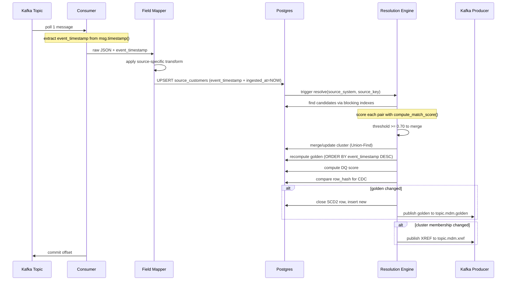

# MDM Spec - Near-Real-Time: Snowflake - Postgres + Kafka

## Marcel Däppen | Principal Solutions Engineer | Snowflake | EMEA Growth Markets

Version 2026-06-03

## Context

The current Snowflake MDM pipeline runs as batch (TARGET_LAG = 24h). This design replicates the fuzzy matching, survivorship, and DQ logic in Postgres for sub-second golden record updates, with Kafka as the event bus using **single-message processing** (one record processed at a time, with cluster-local recomputation and conditional golden publish).

### Source Field Mappings (from views.sql)

| CRM_A raw fields | CRM_B raw fields | CRM_C raw fields |
|---|---|---|
| `src_customer_id` | `customer_key` | `ticket_customer_id` |
| `first_name` | `name` (full name) | `caller_name` (full name) |
| `last_name` | (split from name) | (split from caller_name) |
| `email` | `email_address` | `callback_email` |
| `phone` | `mobile` | `callback_phone` |

---

## Scope and MVP Boundaries

**In scope (Phase 1 / MVP):**
- Customer matching only (name, email, phone)
- Deterministic + probabilistic rules (D01, D02, C01, P01, P03, P04)
- No address-based matching in scoring (MATCH-P02 and MATCH-P05 deferred to Phase 2)
- No deletes/tombstones (insert/update CDC only)
- No ML models -- rule-based only
- Single consumer instance
- Docker Desktop local testing
- At-least-once processing with idempotent UPSERTs

**Out of scope / Phase 2:**
- Address pipeline (BIZ-13) -- address survivorship, address DQ, address golden records
- Address-based match scoring (MATCH-P02 street JW, MATCH-P05 phone+city)
- Delete/tombstone event handling
- Schema registry / Avro serialization
- Multi-region deployment
- Production HA/failover for Postgres
- ML-based matching or active learning

---

## Glossary

| Term | Definition |
|------|-----------|
| `source_key` | Primary key from the originating CRM system (e.g., `src_customer_id` in CRM_A) |
| `cluster_id` | Auto-incremented ID grouping matched source records. One cluster = one real-world entity. **Note:** `customer_id` is an alias for `cluster_id` used in outbound events and XREF -- they always hold the same value. Schema uses `cluster_id` internally and `customer_id` in external-facing contracts (outbound Kafka, Snowflake tables, XREF). |
| `customer_id` | Alias for `cluster_id` in external-facing contexts (outbound events, XREF, Snowflake). Always equals `cluster_id`. |
| `golden record` | The single current best-version of a cluster, after survivorship rules are applied |
| `current row` | The golden record row with `is_current=TRUE` (`valid_to = '9999-12-31'`) |
| `history row` | A closed golden record version with `is_current=FALSE` |
| `event_timestamp` | When the source system changed the record (from Kafka message timestamp) |
| `ingested_at` | When the MDM engine received and processed the record (Postgres `NOW()`) |

---

## Assumptions and Constraints

- Source systems provide reliable Kafka timestamps (`CreateTime`) reflecting when the change actually occurred
- Source keys (`src_customer_id`, `customer_key`, `ticket_customer_id`) are immutable -- a key is never reused for a different entity
- Message ordering is only guaranteed per partition/key -- cross-partition ordering is not assumed
- Source systems publish inserts and updates only (no deletes in MVP)
- Each source system has a stable schema -- field names do not change without consumer redeployment
- Snowflake Managed Postgres provides standard PostgreSQL wire protocol and DDL compatibility

---

## Requirements Summary

### Business Requirements (BIZ)

| ID | Title | Status |
|----|-------|--------|
| BIZ-01 | Kafka Inbound Topics | Done |
| BIZ-02 | Single-Message Consumer | Done |
| BIZ-03 | Incremental Resolution | Done |
| BIZ-04 | Blocking Indexes | Done |
| BIZ-05 | Rule-Based Matching | Done |
| BIZ-06 | Transitive Cluster Management | Done |
| BIZ-07 | Survivorship Recomputation | Done |
| BIZ-08 | DQ Scoring | Done |
| BIZ-09 | Kafka Outbound (CDC) | Done |
| BIZ-10 | Batch Re-Resolution | Done |
| BIZ-11 | SCD2 History | Done |
| BIZ-12 | XREF Table | Done |
| BIZ-13 | Address Pipeline | Planned (Phase 2) |

### Infrastructure Requirements (INF)

| ID | Title | Status |
|----|-------|--------|
| INF-01 | Kafka Container (local dev/test) | Done |
| INF-01b | Kafka on Confluent Cloud (production) | Planned |
| INF-02 | Postgres Container (local dev/test) | Done |
| INF-02b | Snowflake Managed Postgres (production) | Planned |
| INF-03 | MDM Engine Container (local dev/test) | Done |
| INF-03b | MDM Engine on SPCS (production) | Planned |
| INF-04 | Local Docker Desktop Dev Environment | Done |
| INF-05 | Throughput Target | Done (~103ms at 1M records) |
| INF-06 | Snowflake Interactive Table | Planned |
| INF-07 | Snowflake Table Mirroring (SCD2 + XREF) | Planned |

### Testing Requirements (TST)

| ID | Title | Status |
|----|-------|--------|
| TST-01 | Synthetic Event Producer (Faker) | Done |
| TST-02 | E2E Integration Test Script | Done |
| TST-03 | Streamlit Golden Record Viewer | Done |
| TST-04 | Production-Scale Load Test (1M customers) | Done (infra ready) |

---

## Snowflake Target Architecture

| Target | Purpose | Data | Latency |
|--------|---------|------|---------|
| INF-06: Interactive Table | Current-state serving, low-latency queries | Latest golden record only (1 row per customer) | Sub-second |
| INF-07: Mirrored Tables | Analytics, BI, reporting, SCD2 history | Full history + XREF + addresses | Near-real-time (seconds) |

---

## Environment Configuration

| Setting | Local (Docker) | CI | Production |
|---------|---------------|-----|-----------|
| Kafka partitions | 1 | 3 | 3+ |
| Kafka replication | 1 | 1 | 3 |
| Postgres | `postgres:16-alpine` container | Snowflake Managed Postgres | Snowflake Managed Postgres |
| MDM Engine | Docker container | SPCS (Snowpark Container Services) | SPCS (Snowpark Container Services) |
| Consumer instances | 1 | 1 | 1-3 (per partition) |
| Topic retention | 1 day | 1 day | 7 days |

---

## Processing Guarantees

**Delivery semantics:** At-least-once processing.

**Database state idempotency:** All DB operations are idempotent by design:
- UPSERT uses `ON CONFLICT ... DO UPDATE` with `WHERE event_timestamp <= EXCLUDED.event_timestamp` -- same message processed twice produces identical DB state
- Cluster assignment is deterministic (same matches = same cluster)
- Golden record is recomputed from source data (not incremented) -- reprocessing produces identical output

**Outbound event duplication:** Kafka outbound uses idempotent producer (`enable.idempotence=true`), but in failure/retry scenarios, duplicate outbound messages may still occur (same `customer_id` + `row_hash`). **Downstream consumers (Snowflake, dashboards) must tolerate duplicate events** by deduplicating on `(customer_id, row_hash)` or treating repeated events as no-ops.

**Transaction boundary:** A single Postgres transaction encompasses:
1. Source UPSERT
2. Cluster update (Union-Find merge)
3. XREF update
4. Golden record recomputation
5. SCD2 close/open

Kafka publish happens **after** transaction commit. If publish fails, the consumer does not commit the Kafka offset and retries on next poll. This means the entire DB transaction may execute again on reprocessing -- this is expected and safe because all operations are deterministic and idempotent (same input = same DB state).

---

## Failure Handling

| Scenario | Behavior |
|----------|----------|
| Malformed JSON payload | Log error, skip message, commit offset, increment `errors_skipped` counter |
| Unknown topic / unregistered mapper | Log error, skip message, commit offset |
| Postgres connection lost | Retry with exponential backoff (3 attempts), then crash and let orchestrator restart |
| Kafka publish fails after DB commit | Retry produce (idempotent producer handles duplicates). On persistent failure, log to DLQ topic `topic.mdm.dlq` |
| Duplicate message delivery | No-op -- UPSERT is idempotent, golden recomputation is deterministic |
| Out-of-order message | UPSERT `WHERE` clause rejects older events -- no overwrite, no error |
| Consumer crash mid-processing | Message not committed -- reprocessed on restart (at-least-once) |
| Deletes / tombstones | **Not supported in MVP.** Null-value messages are skipped with a warning log |

---

## Observability

| Metric | Source | Purpose |
|--------|--------|---------|
| `messages_processed_total` | Consumer | Total inbound messages processed (by topic) |
| `messages_skipped_total` | Consumer | Malformed/unparseable messages skipped |
| `upsert_duration_ms` | UPSERT | Postgres write latency per message |
| `resolution_duration_ms` | Resolver | Full resolution cycle time (blocking + scoring + cluster + golden) |
| `golden_published_total` | Producer | Golden record changes published to outbound |
| `golden_noop_total` | CDC | Recomputations that produced no change (row_hash unchanged) |
| `cluster_merges_total` | Cluster Manager | Number of cluster merge events |
| `dlq_messages_total` | Producer | Messages sent to DLQ after persistent publish failure |
| `consumer_lag` | Kafka | Consumer group lag (messages behind head) |
| `source_to_ingest_latency_ms` | `ingested_at - event_timestamp` | Time from source change to MDM ingest (includes network + queue) |
| `engine_processing_ms` | Application timer | Local processing time (UPSERT + resolve + publish) |
| `source_to_publish_latency_ms` | Application telemetry | Full end-to-end: source change to golden published on Kafka |

**Logging:** Structured JSON logs with `source_system`, `source_key`, `cluster_id`, `event_type` for traceability.

**DLQ:** `topic.mdm.dlq` receives messages that failed Kafka outbound publish after 3 retries. Includes original golden payload + error reason. Note: malformed inbound messages are logged and skipped (not sent to DLQ) because they cannot be meaningfully reprocessed without source-side fixes.

---

## Business Requirements Detail

### BIZ-01: Kafka Inbound Topics

**Status:** Done

**What:** Each CRM source (A, B, C) publishes change events to its own dedicated Kafka topic. Messages are JSON with source-specific field names. The message key is the source primary key to ensure partition affinity (all updates for one record go to the same partition, preserving order).

**How:**
- 3 Kafka topics: `topic.crm.a`, `topic.crm.b`, `topic.crm.c`
- Configuration: see Environment Configuration table for partitions/replication per environment
- Each CRM publishes CDC events (insert/update) using Kafka `CreateTime` timestamp
- Message key = source primary key (e.g., `src_customer_id` for CRM_A)
- Message value = JSON payload with source-specific field names

**Acceptance criteria:** Messages published to any of the 3 topics are consumed and correctly mapped into `source_customers` with all blocking keys populated.

### BIZ-02: Single-Message Consumer

**Status:** Done

**What:** A Python consumer polls one message at a time from any of the 3 topics, applies the source-specific field mapper to normalize it into the common schema (`SourceCustomer` dataclass), and UPSERTs into the Postgres `source_customers` table. The target SLA is: Kafka message received to Postgres row committed < 100ms.

**How:**
- Library: `confluent-kafka` Consumer with `enable.auto.commit=false`
- Processing model: single-message (poll one, process one, commit one)
- Field mapping: topic-to-mapper dispatch (`TOPIC_MAPPER` dict)
- Postgres writes: `psycopg3` with prepared statements for low-latency
- Offset commit: manual, only after successful UPSERT + resolution
- Timestamp extraction: `msg.timestamp()` provides `event_timestamp`
- Out-of-order protection: UPSERT includes `WHERE event_timestamp <= EXCLUDED.event_timestamp`

**Functional acceptance:** A message with an older `event_timestamp` than the existing row does NOT overwrite it. **Performance target (benchmark):** Message received to row committed < 100ms under controlled conditions.

### BIZ-03: Incremental Resolution

**Status:** Done (infrastructure ready, pending full 1M validation run)

**What:** On each UPSERT, only the incoming record is resolved against existing candidates -- not a full N x N re-computation. This limits work to O(block_size) comparisons per message, enabling sub-second latency even as the dataset grows.

**How:**
- After UPSERT, call `resolve(source_system, source_key)`
- Resolution queries candidates via blocking indexes (BIZ-04)
- Scores each candidate pair (BIZ-05)
- Updates cluster membership (BIZ-06)
- Recomputes golden record for affected cluster only (BIZ-07)
- Typical candidate set size: 10-50 records (not thousands)

**Functional acceptance:** A new record matching an existing record is assigned to the same cluster. **Performance target (benchmark):** Resolution completes in < 50ms for a dataset of 2,000 source records.

### BIZ-04: Blocking Indexes

**Status:** Done

**Measured performance (local Docker Desktop, 1M records in Postgres):**
- Single update end-to-end latency: **~103ms** (Kafka in -> golden updated -> Kafka out)
- Includes: UPSERT + tiered blocking + matching + survivorship + DQ + SCD2 + CDC publish

**Optimizations applied:**
- Tiered blocking: email_domain (most precise) -> phone_suffix -> SOUNDEX, each with LIMIT 50
- In-memory cluster cache (eliminates repeated SQL lookups)
- Batch cluster ID lookups (single WHERE IN query for all matched candidates)
- Prepared statements for UPSERT hot path

**What:** Pre-computed blocking keys stored as indexed columns on `source_customers`. Candidate lookup queries these indexes to avoid full table scans. Any record sharing at least one blocking key with the incoming record becomes a candidate for pairwise scoring.

**How:**
- 3 blocking keys computed at ingest time:
  - `block_soundex` = `jellyfish.soundex(last_name)` (4-char code)
  - `block_email_domain` = substring from `@` onward (e.g., `@acme.com`)
  - `block_phone_suffix` = last 4 digits of phone number
- Postgres B-tree indexes: `idx_block_soundex`, `idx_block_email`, `idx_block_phone`
- Query uses OR across all three with IS NOT NULL guards
- Typical block size: 10-50 records per blocking key value

**Functional acceptance:** A record sharing a blocking key with an existing record appears in the candidate set. **Performance target (benchmark):** Candidate lookup executes in < 10ms with 2,000 source records.

### BIZ-05: Rule-Based Matching

**Status:** Planned

**What:** Pairwise scoring of the incoming record against each candidate. Uses deterministic rules (high confidence, exact matches) and probabilistic rules (fuzzy string similarity). The final score combines both: `MAX(deterministic) + SUM(probabilistic)`. If the combined score >= 0.70, the records are considered a match. There is **no machine learning model** -- this is a classical approach using the `jellyfish` library for Jaro-Winkler similarity (~1 microsecond per comparison).

**How:**
- Deterministic rules (take the MAX):
  - MATCH-D01: Email exact equality = 1.00
  - MATCH-D02: Phone last-10 digits equality = 0.95
  - MATCH-C01: Canonical name exact (case-insensitive) = 0.80
- Probabilistic rules (SUM all that fire):
  - MATCH-P01: Full name Jaro-Winkler >= 0.85 = jw * 0.30
  - MATCH-P03: Last name SOUNDEX equality = 0.20
  - MATCH-P04: Email domain match + first name JW >= 0.90 = 0.15
  - ~~MATCH-P02: Address street JW + postal exact = 0.25~~ **(Phase 2)**
  - ~~MATCH-P05: Phone last-7 + same city = 0.10~~ **(Phase 2)**
- Formula (MVP): `final = MAX(D01, D02, C01) + P01 + P03 + P04`
- Threshold: `>= 0.70` triggers a merge
- Library: `jellyfish.jaro_winkler_similarity()` for JW, `jellyfish.soundex()` for SOUNDEX

**Acceptance criteria:** Known matching pairs from the batch pipeline (Bill/William Smith, same email) produce scores >= 0.70. Known non-matches produce scores < 0.70.

### BIZ-06: Transitive Cluster Management

**Status:** Planned

**What:** When record A matches record B, and B already matches C (in an existing cluster), all three must be in the same cluster. This requires transitive closure of match relationships. Uses a Union-Find (disjoint set) data structure for O(1) amortized merge operations.

**How:**
- `customer_clusters` table: `(source_system, source_key) -> cluster_id`
- `cluster_id` = `customer_id` (they are the same value)
- Union-Find with path compression in Python for in-memory operations
- On new match between records in different clusters:
  1. Identify smaller cluster (fewer members)
  2. UPDATE all records in smaller cluster to the larger cluster's ID
  3. Recompute golden for the merged cluster
- On new record joining existing cluster:
  1. INSERT into `customer_clusters` with existing `cluster_id`
  2. Recompute golden for that cluster
- On no match found:
  1. Create new cluster with `cluster_id = nextval('cluster_seq')`

**Acceptance criteria:** After merging two clusters, all source records in both original clusters point to the same `cluster_id`.

### BIZ-07: Survivorship Recomputation

**Status:** Planned

**What:** When a cluster changes, recompute the golden record for that cluster only. Survivorship picks the best value per attribute from all source records in the cluster, using a priority ordering: (1) completeness, (2) source trust priority, (3) recency.

**How:**
- Query all source records in the affected cluster from `source_customers`
- For each attribute (first_name, last_name, email, phone), pick the best value:
  1. Completeness: non-null, valid format (e.g., email contains @, phone >= 7 digits)
  2. Source priority: CRM_A=1, CRM_B=2, CRM_C=3 (lower = higher trust)
  3. Recency: `event_timestamp DESC` (most recently changed at source wins)
- Compute `source_count = COUNT(DISTINCT source_system)` in cluster
- UPSERT result into `golden_customers`
- Typically touches 1-3 source records per cluster

**Acceptance criteria:** Given CRM_A (email=null) and CRM_B (email=valid), survivorship picks CRM_B's email regardless of source priority.

### BIZ-08: DQ Scoring

**Status:** Planned

**What:** Apply the same non-AI data quality rules as the batch Snowflake pipeline on the newly computed golden record. AI-based rules (fake name detection) are excluded because sub-second latency leaves no room for model inference. Base score 100, penalties for issues, bonuses for completeness. Clamped 0-100.

**How:**
- Python function `compute_dq_score(golden) -> int`
- Rules (same as `DT_CUSTOMER_GOLDEN_FUZZY`):
  - DQ-001: Invalid email format = -20
  - DQ-002: Disposable email domain = -5
  - DQ-003: Missing/short first_name = -20
  - DQ-004: Special chars in first_name = -5
  - DQ-005: Missing/short last_name = -20
  - DQ-006: Special chars in last_name = -5
  - DQ-007: Invalid phone format = -5
  - DQ-008: Placeholder phone (0000000000, etc.) = -20
  - DQ-C01: No contact method (no valid email AND no valid phone) = -20
  - DQ-C02: No complete name (both first and last missing) = -20
  - DQ-X03: Name appears in email = +5
  - DQ-AI01: (skipped in NRT -- no AI fake detection)
- Formula: `GREATEST(0, LEAST(100, 100 + sum_of_penalties_and_bonuses))`

**Acceptance criteria:** A golden record with valid email, valid name, valid phone produces DQ score >= 95. A record with no email and no phone produces DQ score <= 60.

### BIZ-09: Kafka Outbound (CDC)

**Status:** Planned

**What:** After golden record recomputation, compare the SHA2 row hash with the previous version. If changed, publish the new golden record to `topic.mdm.golden`. XREF changes are published to a separate `topic.mdm.xref` topic. Only actual changes trigger a publish.

**How:**
- Compute `row_hash = SHA256(first_name|last_name|email|phone|dq_score)`
- Compare with `previous_hash` stored in `golden_customers`
- If different (or first time): publish to `topic.mdm.golden`
- On cluster membership change (new source record added, cluster merge): publish XREF update to `topic.mdm.xref`
- Library: `confluent-kafka` Producer with `acks=all`, `enable.idempotence=true`
- Message key per topic:
  - `topic.mdm.golden`: `customer_id` (partition affinity for golden record consumers)
  - `topic.mdm.xref`: `source_system|source_key` (partition affinity per source record)

**Outbound event contract:**
```json
{
  "customer_id": 42,
  "event_type": "UPDATE",
  "first_name": "William",
  "last_name": "Smith",
  "email": "bill@acme.com",
  "phone": "+11043321819",
  "dq_score": 95,
  "source_count": 2,
  "valid_from": "2026-06-04T10:32:15Z",
  "previous_valid_from": "2026-06-01T08:00:00Z",
  "row_hash": "a1b2c3...",
  "previous_hash": "d4e5f6...",
  "published_at": "2026-06-04T10:32:15.123Z"
}
```

**Acceptance criteria:** An unchanged golden record (same attributes after re-survivorship) produces NO outbound message.

**Note:** This event contract (BIZ-09) is the **canonical source of truth** for all downstream Snowflake ingestion (INF-06 Interactive Table, INF-07 Mirrored Tables). Downstream consumers reconstruct SCD2 history from the `valid_from` and `previous_hash` fields in this contract.

**XREF outbound event contract** (`topic.mdm.xref`):
```json
{
  "source_system": "CRM_B",
  "source_key": "B001",
  "customer_id": 42,
  "event_type": "ASSIGN",
  "previous_customer_id": null,
  "published_at": "2026-06-04T10:32:15.123Z"
}
```
INF-07 (Snowflake Mirroring) consumes from both `topic.mdm.golden` and `topic.mdm.xref` to keep XREF tables current.

### BIZ-10: Batch Re-Resolution

**Status:** Planned

**What:** On-demand full re-computation of all clusters from scratch. Used for consistency checks, rule change validation, initial bootstrap, or periodic reconciliation.

**How:**
- CLI command: `python -m nrt_mdm.batch_resolve`
- Steps:
  1. Truncate `customer_clusters` (cluster assignments reset)
  2. Close all current golden records: `UPDATE golden_customers SET is_current = FALSE, valid_to = NOW() WHERE is_current = TRUE` (history rows preserved)
  3. Iterate all records in `source_customers`
  4. Apply full blocking + matching + clustering globally
  5. Recompute all golden records with survivorship + DQ (inserts new `is_current = TRUE` rows)
  6. Publish all changes to Kafka outbound
- Note: SCD2 history is preserved (old rows remain with `is_current = FALSE`). Only cluster assignments and current golden rows are rebuilt.
- Expected runtime: ~30 seconds for 1,800 records

**Acceptance criteria:** After batch re-resolution, golden record count and merge rate match the Snowflake FUZZY pipeline within +/- 1%.

### BIZ-11: SCD2 History

**Status:** Planned

**What:** Golden records maintain full change history with `valid_from`, `valid_to`, `is_current` columns. Each change creates a new row (close previous, insert new). Enables point-in-time queries.

**How:**
- Database: **Postgres** (same instance as source/golden tables -- INF-02)
- On golden record change detected (row_hash differs):
  1. `UPDATE golden_customers SET valid_to = NOW(), is_current = FALSE WHERE cluster_id = :id AND is_current = TRUE`
  2. `INSERT INTO golden_customers (..., valid_from = NOW(), valid_to = '9999-12-31', is_current = TRUE)`
- Row hash: `SHA256(first_name|last_name|email|phone|dq_score)`
- Both operations in same Postgres transaction
- Index on `(cluster_id, is_current)` for fast current-record lookups
- Executed by MDM Engine (INF-03) as part of `resolve_and_publish()`

**Acceptance criteria:** After 3 updates to the same cluster, history table contains 3 rows: 2 with `is_current=FALSE` and 1 with `is_current=TRUE`.

### BIZ-12: XREF Table

**Status:** Planned

**What:** Real-time cross-reference mapping every `(source_system, source_key)` pair to its golden `customer_id`. Updated atomically with cluster changes.

**How:**
- Table: `customer_xref (source_system, source_key, customer_id, created_at)`
- Updated in the same Postgres transaction as cluster merge/golden recomputation
- Indexed on both `(source_system, source_key)` and `(customer_id)`
- On cluster merge: UPDATE all xref rows in the absorbed cluster to new customer_id

**Acceptance criteria:** Every row in `source_customers` has exactly one corresponding row in `customer_xref`. XREF changes (new assignment, reassignment on cluster merge) emit events to `topic.mdm.xref`.

### BIZ-13: Address Pipeline (Phase 2)

**Status:** Planned

**What:** Parallel address resolution alongside customer. Source addresses linked to customer clusters. Survivorship picks best address per customer. Address DQ scoring (DQ-011, DQ-012, DQ-X04). Note: address fields are NOT used in customer match scoring in MVP (see Phase 2 deferred rules).

**How:**
- `source_addresses` table: `(source_system, source_key, source_customer_key, street, city, postal_code, country, event_timestamp)`
- Linked to customer clusters via: `source_customer_key -> customer_clusters.source_key`
- On customer cluster change, recompute address golden:
  1. Find all source addresses for records in the cluster
  2. Apply address survivorship (completeness, priority, recency)
  3. Compute address DQ score (base 100, -5 short street, -20 null city, +10 complete)
  4. UPSERT into `golden_addresses`
- Publishes address changes to `topic.mdm.golden.addresses`

**Acceptance criteria:** At most one current golden address per customer cluster. Customers with at least one source address have exactly one current golden address. Customers without source addresses have no golden address. Address DQ scores are between 0-100.

---

## Infrastructure Requirements Detail

### INF-01: Kafka Container

**Status:** Planned

**What:** Kafka runs as a single-node container (KRaft mode, no ZooKeeper) for local dev and CI. Multi-platform image (linux/amd64 + linux/arm64).

**How:**
- Image: `confluentinc/cp-kafka:7.6` (KRaft mode, single-node)
- Ports: `9092` (plaintext), `9093` (controller)
- Environment: `KAFKA_PROCESS_ROLES=broker,controller`, `CLUSTER_ID` auto-generated
- Topics auto-created on first produce (or via init container)
- Volume: `/var/lib/kafka/data` for persistence across restarts
- Platform: `platform: linux/amd64,linux/arm64` in docker-compose
- Health check: `kafka-topics --bootstrap-server localhost:9092 --list`
- Note: replication-factor=1 locally, =3 in production (see Environment Configuration)

**Acceptance criteria:** `docker compose up kafka` starts and becomes healthy within 30 seconds.

### INF-02: Postgres Container / Snowflake Managed Postgres

**Status:** Planned

**What:** Postgres hosts all MDM tables. Container for local/CI, Snowflake Managed Postgres for production (not SPCS). Same schema DDL works in both environments.

**How:**
- Local: `postgres:16-alpine` (multi-arch), port `5432`
- Init scripts: mount `schema/*.sql` into `/docker-entrypoint-initdb.d/`
- Volume: `/var/lib/postgresql/data` for persistence
- Health check: `pg_isready -U mdm`
- Extensions: none required (all string similarity runs in Python)
- **Production:** Snowflake Managed Postgres. Connection switches via `POSTGRES_DSN` env var. No container-specific features used.

**Acceptance criteria:** Schema DDL runs without modification on both `postgres:16` container and Snowflake Managed Postgres.

### INF-03: MDM Engine Container

**Status:** Planned

**What:** A single Python container runs the entire MDM engine: Kafka consumer, field mapping, resolution, survivorship, DQ, and Kafka producer. All co-located for simplicity and low latency.

**How:**
- Base image: `python:3.12-slim` (multi-arch)
- Dependencies: `confluent-kafka`, `psycopg[binary]`, `jellyfish`
- Entrypoint: `python -m nrt_mdm.consumer`
- Environment: `KAFKA_BOOTSTRAP_SERVERS`, `POSTGRES_DSN`, `KAFKA_GROUP_ID`
- Stateless (all state in Postgres)
- Waits for Kafka + Postgres to be healthy before starting
- Scaling: run multiple replicas (one per Kafka partition) for higher throughput
- **Production:** Deployed as a SPCS (Snowpark Container Services) service in Snowflake. Same Docker image, pushed to Snowflake image registry. Connects to Snowflake Managed Postgres via internal networking. This is an explicit architectural decision: MDM Engine = SPCS, Postgres = Snowflake Managed Postgres, Kafka = external managed Kafka (e.g., Confluent Cloud).

**Acceptance criteria:** Container starts, connects to Kafka and Postgres, and begins processing within 10 seconds.

### INF-04: Local Docker Desktop Dev Environment

**Status:** Planned

**What:** The entire stack runs locally with `docker compose up`. No cloud dependencies for development and testing.

**How:**
- `docker-compose.yml` defines: Kafka, Postgres, MDM Engine, test producer
- Single command: `docker compose up --build`
- Kafka UI: `provectuslabs/kafka-ui` on port `8080` for topic inspection
- **Startup seeding:** Test producer replays existing CSV files (1,500 records from batch pipeline) as Kafka events for bootstrap
- Postgres at `localhost:5432`, Kafka at `localhost:9092`
- `.env` file with default local credentials
- `docker compose --profile test up` runs integration tests

**Acceptance criteria:** `docker compose up` produces golden records queryable in Postgres within 60 seconds of startup.

### INF-05: Throughput Target

**Status:** Planned

**What:** The system must meet different throughput targets depending on deployment configuration.

**MVP baseline (single consumer, 1 partition):**
- Target: 100-300 events/second sustained
- P99 latency: < 500ms per event
- Sufficient for development, testing, and low-volume production

**Scaled production (3 consumers, 3 partitions):**
- Target: 1,000 events/second sustained
- P99 latency: < 500ms per event
- Requires: 3 Kafka partitions, 3 consumer instances, connection pooling

**How:**
- Single-threaded consumer with prepared statements (baseline)
- Scale: multiple consumer instances (one per Kafka partition)
- Connection pooling: `psycopg_pool` (min=2, max=10)
- Benchmark: `kafka-producer-perf-test --throughput 1000`
- Target breakdown: UPSERT < 5ms, blocking < 10ms, scoring < 1ms/pair, survivorship < 5ms, golden write < 5ms

**Acceptance criteria (benchmark-scoped):** Under controlled benchmark conditions (Docker Desktop, warm caches), single consumer processes >= 100 events/second. With 3 consumers, aggregate throughput >= 1,000 events/second.

### INF-06: Snowflake Interactive Table

**Status:** Planned

**What:** Low-latency queryable table in Snowflake consuming `topic.mdm.golden`. Current-state only (latest golden record per customer). For real-time serving use cases.

**How:**
- Snowpipe Streaming SDK or Kafka Connector ingests from `topic.mdm.golden`
- Target: Snowflake Interactive Table with `TARGET_LAG = DOWNSTREAM`
- Schema: `(customer_id, first_name, last_name, email, phone, dq_score, source_count, last_updated)`
- Overwrites on each update (no history -- that's INF-07's job)

**Acceptance criteria:** A golden record change in Postgres is queryable in the Interactive Table within 5 seconds.

### INF-07: Snowflake Table Mirroring (SCD2 + XREF)

**Status:** Planned

**What:** Mirror full golden record history and XREF into standard Snowflake tables for analytics, BI, and reporting. Complements INF-06 (which only stores current state).

**How:**
- Ingest from `topic.mdm.golden` via Snowpipe Streaming or Kafka Connector
- Target tables (standard Snowflake, not Interactive):
  - `CRMA_NRT_TB_CUSTOMER` -- current golden records (MERGE on customer_id)
  - `CRMA_NRT_TB_CUSTOMER_HISTORY` -- full SCD2 (append-only from outbound events)
  - `CRMA_NRT_TB_XREF` -- cross-reference (MERGE on source_system + source_key, from `topic.mdm.xref`)
  - `CRMA_NRT_TB_ADDRESSES` -- current golden addresses **(Phase 2 -- populated when BIZ-13 is implemented)**
  - `CRMA_NRT_TB_ADDRESSES_HISTORY` -- address SCD2 history **(Phase 2)**
- Outbound event contract (BIZ-09) includes `valid_from`, `previous_hash` for SCD2 reconstruction
- Schema matches batch pipeline DTs for compatibility
- Enables side-by-side comparison: batch vs NRT results

**Acceptance criteria:** After 10 golden record updates, Snowflake history table contains 10 rows with correct `valid_from` ordering.

---

## Testing Requirements Detail

### TST-01: Synthetic Event Producer (Faker)

**Status:** Done

**What:** Python test data producer that generates realistic CRM events and publishes to all 3 Kafka topics. Adapted from [scripts/generate_test_data.py](scripts/generate_test_data.py). Generates the same matching scenarios so NRT results can be validated against batch pipeline outputs.

**How:**
- Reuses core logic from existing generator:
  - `Faker` for base identity generation
  - `CORTEX_TEST_PAIRS` (Bill/William, Bob/Robert, etc.) for overlap scenarios
  - `FAKE_NAMES` for DQ violation scenarios
  - `typo_name()` for Jaro-Winkler fuzzy matching
  - `generate_phone()` with format variants
- Outputs to Kafka (JSON):
  - CRM_A: `{"src_customer_id": "A001", "first_name": "Bill", "last_name": "Smith", "email": "bill@acme.com", "phone": "+11043321819"}`
  - CRM_B: `{"customer_key": "B001", "name": "William Smith", "email_address": "wsmith@acme.com", "mobile": "104-332-1819"}`
  - CRM_C: `{"ticket_customer_id": "C001", "caller_name": "Bill Smth", "callback_email": "bill@acme.com", "callback_phone": "(104) 332-1819"}`
- Modes:
  - `--mode replay` -- read existing CSV files from `output/` and replay all 1,500 records as Kafka events (startup bootstrap)
  - `--mode seed` -- generate 100 new random events and exit
  - `--mode continuous` -- generate 1 event/second indefinitely (demo)
  - `--mode burst` -- generate 1,000 events as fast as possible (load test)
- Configurable: `--records N`, `--overlap-pct 0.30`, `--dq-violation-pct 0.05`
- Runs as Docker Compose service (`profile: test`) or standalone: `python -m nrt_mdm.test_producer --mode seed`

**Acceptance criteria:** `--mode replay` produces exactly 1,500 messages (600 CRM_A + 400 CRM_B + 500 CRM_C) matching batch pipeline input counts.

### TST-02: E2E Integration Test Script

**Status:** Done

**What:** A single script that orchestrates a full end-to-end test locally: starts all containers, loads initial data from shared CSV files, sends 1 random incremental update, measures latency, and verifies the golden record change with full BEFORE/AFTER/CDC trace.

**How:**
- Shell wrapper: `nrt/tests/run_e2e.sh` (ensures Docker, venv, and test data)
- Script: `nrt/tests/e2e_test.py`
- Two-phase design:

  **Phase 1 — Initial Load (skipped if DB already populated):**
  1. Generate test data via `shared/scripts/generate_test_data.py` (1,500 records)
  2. Replay all CSVs via `test_producer --mode replay` into Kafka
  3. Wait for golden record count to stabilize (~1,113 golden records)

  **Phase 2 — Single Random Update:**
  1. Pick 1 random CRM_A source record from Postgres (CRM_A = highest survivorship priority)
  2. Build an email update event with ms-timestamp suffix for uniqueness
  3. Snapshot golden record BEFORE
  4. Subscribe CDC consumer on `topic.mdm.golden` and `topic.mdm.xref`
  5. Produce exactly 1 message to `topic.crm.a`
  6. Poll golden record until change detected (latency measurement)
  7. Snapshot golden record AFTER
  8. Collect and display CDC Kafka events as JSON

- **Verbose output:**
  ```
  --- Golden Record (BEFORE) ---
    cluster=1104: Robert Eaton | email=jorge47@example.org | phone=... | dq=100 | sources=1

  --- Inbound Event ---
  [topic.crm.a] key=A000581
    {"src_customer_id": "A000581", "first_name": "Robert", "last_name": "Eaton", "email": "jorge47@updated-corp.com", ...}

  Produced 1 update event
  Waiting for processing... done (107ms)

  --- Golden Record (AFTER) ---
    cluster=1104: Robert Eaton | email=jorge47@updated-corp.com | phone=... | dq=100 | sources=1

  --- Changes ---
    email: jorge47@example.org -> jorge47@updated-corp.com

  --- CDC Kafka Events ---
    [golden] {"customer_id": 1104, "event_type": "UPDATE", ...}
  ```

- Exit code: 0 = all assertions pass, 1 = failure with details
- Measured latency: ~100-200ms end-to-end (Kafka produce to golden record updated in Postgres)

**Acceptance criteria:** Script exits 0 on a clean Docker Desktop environment with no manual intervention. Golden record count ~1,113. Single update processed in <500ms with correct BEFORE/AFTER diff and CDC event published.

### TST-03: Streamlit Golden Record Viewer

**Status:** Planned

**What:** A single-page Streamlit app that connects to the Postgres database and allows browsing/filtering golden records. Useful for manual inspection during development, demos, and debugging.

**How:**
- File: `nrt/app/streamlit_app.py`
- Single page with:
  - **Search/filter:** text input for `customer_id` (cluster_id), or partial name/email search
  - **Golden record card:** display current golden record fields (name, email, phone, DQ score, source count)
  - **Source records table:** all source records belonging to that cluster (from `source_customers` via `customer_clusters`)
  - **SCD2 history table:** all rows from `golden_customers` for that cluster (showing valid_from/valid_to, is_current)
  - **XREF table:** cross-references from `customer_xref` for that cluster
- Connects directly to Postgres (`localhost:5432`, same DSN as E2E test)
- Runs locally: `streamlit run nrt/app/streamlit_app.py`
- Added to Docker Compose as optional service (profile: `ui`)

**Acceptance criteria:** App loads, searching by customer_id shows golden record + source records + history. No authentication required (local dev only).

### TST-04: Production-Scale Load Test (1M customers)

**Status:** Planned

**What:** Validate that the NRT MDM pipeline handles production-scale data volumes: 1 million unique customers across 3 CRM sources, with realistic overlap rates, DQ issues, and update patterns. Measures throughput, latency percentiles, and resource consumption under sustained load.

**How:**
- Integrated into `e2e_test.py` via `--scale` flag (single entry point):
  ```bash
  ./nrt/tests/run_e2e.sh --scale large --duration 300
  ```
- `generate_all(scale)` in `shared/scripts/generate_test_data.py` provides scale configs:
  - `small`: 1,500 records (600/400/500)
  - `medium`: 100,000 records (40K/35K/25K)
  - `large`: 1,000,000 records (400K/350K/250K)
  - Overlap rate: ~30% (same ratios as small, scaled up)
  - DQ violation rate: ~5%
- **Fast initial load** — direct Postgres bulk insert + `batch_resolve` (not Kafka replay):
  - In-memory generation -> bulk INSERT into source_customers -> batch_resolve computes clusters + golden
  - ~10x faster than Kafka replay for initial bootstrap
- Test phases:
  1. **Bulk load:** Generate in-memory, INSERT to Postgres, run batch_resolve
  2. **Steady-state updates:** Send updates via Kafka at `--rate` (default: 100/sec) for `--duration` seconds
  3. **Latency measurement:** Per-update latency (produce -> golden hash change in Postgres)
  4. **Report:** Throughput, golden count, merge rate, p50/p95/p99, Postgres table sizes
- `docker-compose.loadtest.yml` override tunes Postgres for 1M records (512MB shared_buffers)

**Acceptance criteria:**
- Bulk load of 1M records completes within 30 minutes
- Steady-state update latency: p95 < 500ms at 100 updates/sec
- No OOM kills, no Postgres connection exhaustion
- Golden record count within expected merge range (700K-750K)

---

## Architecture Overview

```
+------------------+     +------------------+     +------------------+
|     CRM A        |     |     CRM B        |     |     CRM C        |
+--------+---------+     +--------+---------+     +--------+---------+
         |                         |                         |
         v                         v                         v
+--------+---------+     +--------+---------+     +--------+---------+
|   topic.crm.a    |     |   topic.crm.b    |     |   topic.crm.c    |
+--------+---------+     +--------+---------+     +--------+---------+
         |                         |                         |
         +------------+------------+
                      |
                      v
+--------------------------------------------------------------------+
|  MDM Engine (Python container / SPCS)                              |
|                                                                    |
|  +-------------------+    +-------------------+                    |
|  | Kafka Consumer    |--->| Field Mapper      |                    |
|  | (single-message)  |    | (CRM_A/B/C)       |                    |
|  +-------------------+    +---------+---------+                    |
|                                     |                              |
|                                     v                              |
|  +-------------------------------------------------------------+   |
|  |  Postgres (Snowflake Managed Postgres in production)        |   |
|  |                                                             |   |
|  |  +-----------------+     +------------------+               |   |
|  |  | source_customers|---->| Blocking Indexes |               |   |
|  |  | (UPSERT)        |     | (SOUNDEX, email, |               |   |
|  |  +-----------------+     |  phone suffix)   |               |   |
|  |                          +--------+---------+               |   |
|  |                                   |                         |   |
|  |                                   v                         |   |
|  |                          +------------------+               |   |
|  |                          | Match Engine     |               |   |
|  |                          | (jellyfish JW)   |               |   |
|  |                          | threshold >= 0.70|               |   |
|  |                          +--------+---------+               |   |
|  |                                   |                         |   |
|  |                                   v                         |   |
|  |                          +------------------+               |   |
|  |                          | Cluster Manager  |               |   |
|  |                          | (Union-Find)     |               |   |
|  |                          +--------+---------+               |   |
|  |                                   |                         |   |
|  |                                   v                         |   |
|  |                          +------------------+               |   |
|  |                          | Survivorship     |               |   |
|  |                          | (completeness,   |               |   |
|  |                          |  priority,       |               |   |
|  |                          |  recency)        |               |   |
|  |                          +--------+---------+               |   |
|  |                                   |                         |   |
|  |                                   v                         |   |
|  |                          +------------------+               |   |
|  |                          | DQ Scorer        |               |   |
|  |                          | (13 rules, 0-100)|               |   |
|  |                          +--------+---------+               |   |
|  |                                   |                         |   |
|  |                                   v                         |   |
|  |  +------------------+   +------------------+                |   |
|  |  | customer_xref    |<--| golden_customers |                |   |
|  |  +------------------+   | (SCD2 history)   |                |   |
|  |                         +--------+---------+                |   |
|  +-------------------------------------------------------------+   |
|                                     |                              |
|                                     v                              |
|                          +---------------------+                   |
|                          | CDC (row_hash diff) |                   |
|                          +----------+----------+                   |
|                                     |                              |
+-------------------------------------+------------------------------+
                                      |
              +-----------------------+-----------------------+
              |                                               |
              v                                               v
+-------------+-------------+               +--------------+--------------+
|   topic.mdm.golden        |               |   topic.mdm.xref            |
+-------------+-------------+               +--------------+--------------+
              |                                               |
              +-------------------+---------------------------+
                                  |
                                  v
+---------------------------------------------------------------------+
|  Snowflake                                                          |
|                                                                     |
|  +---------------------------+   +-------------------------------+  |
|  | Interactive Table (INF-06)|   | Mirrored Tables (INF-07)      |  |
|  | - current golden only     |   | - CUSTOMER (current)          |  |
|  | - sub-second queries      |   | - CUSTOMER_HISTORY (SCD2)     |  |
|  +---------------------------+   | - XREF                        |  |
|                                  | - ADDRESSES (Phase 2)         |  |
|                                  +-------------------------------+  |
+---------------------------------------------------------------------+
```

---

## Timestamp Semantics

| Column | Source | Purpose | Used in |
|--------|--------|---------|---------|
| `event_timestamp` | Kafka message timestamp (`msg.timestamp()`) | When the source system created/changed the record | **Survivorship ordering** (recency tie-breaker) |
| `ingested_at` | `NOW()` at Postgres UPSERT time | When the MDM engine received the record | SLA monitoring, latency measurement |

**Rule:** Source systems MUST set the Kafka message timestamp to their change-event time. If using `CreateTime` (Kafka default), the producer timestamp is used automatically.

---

## Single-Message Processing Flow



---

## Postgres Schema

```sql
CREATE TABLE source_customers (
    source_system VARCHAR(5) NOT NULL,
    source_key VARCHAR(50) NOT NULL,
    first_name VARCHAR(200),
    last_name VARCHAR(200),
    canonical_first_name VARCHAR(200),
    email VARCHAR(255),
    phone VARCHAR(50),
    block_soundex VARCHAR(4),
    block_email_domain VARCHAR(255),
    block_phone_suffix VARCHAR(4),
    event_timestamp TIMESTAMPTZ NOT NULL,
    ingested_at TIMESTAMPTZ NOT NULL DEFAULT NOW(),
    PRIMARY KEY (source_system, source_key)
);

CREATE INDEX idx_block_soundex ON source_customers (block_soundex);
CREATE INDEX idx_block_email ON source_customers (block_email_domain);
CREATE INDEX idx_block_phone ON source_customers (block_phone_suffix);
CREATE INDEX idx_email_exact ON source_customers (email);

CREATE TABLE customer_clusters (
    source_system VARCHAR(5) NOT NULL,
    source_key VARCHAR(50) NOT NULL,
    cluster_id BIGINT NOT NULL,
    PRIMARY KEY (source_system, source_key)
);

CREATE SEQUENCE cluster_seq;
CREATE INDEX idx_cluster_id ON customer_clusters (cluster_id);

CREATE TABLE golden_customers (
    id BIGSERIAL PRIMARY KEY,
    cluster_id BIGINT NOT NULL,
    first_name VARCHAR(200),
    last_name VARCHAR(200),
    email VARCHAR(255),
    phone VARCHAR(50),
    dq_score SMALLINT,
    source_count SMALLINT,
    row_hash VARCHAR(128),
    valid_from TIMESTAMPTZ NOT NULL DEFAULT NOW(),
    valid_to TIMESTAMPTZ NOT NULL DEFAULT '9999-12-31',
    is_current BOOLEAN NOT NULL DEFAULT TRUE
);

CREATE UNIQUE INDEX uq_golden_current_cluster ON golden_customers (cluster_id) WHERE is_current = TRUE;

CREATE TABLE customer_xref (
    source_system VARCHAR(5) NOT NULL,
    source_key VARCHAR(50) NOT NULL,
    customer_id BIGINT NOT NULL,
    created_at TIMESTAMPTZ NOT NULL DEFAULT NOW(),
    PRIMARY KEY (source_system, source_key)
);

CREATE INDEX idx_xref_customer ON customer_xref (customer_id);

-- Note: No explicit foreign keys between tables. This is intentional:
-- FKs add write latency (constraint checks) on every UPSERT in the hot path.
-- Referential integrity is guaranteed by application logic (single transaction
-- encompasses cluster update + XREF update + golden write).
```

---

## Dependencies

```
confluent-kafka >= 2.3
psycopg[binary] >= 3.1
jellyfish >= 1.0
faker >= 24.0
```

---

## Project Structure

```
MasterDataManagement/
  nrt/
    pyproject.toml
    docker-compose.yml
    .env.example
    config.yaml
    src/
      nrt_mdm/
        __init__.py
        consumer.py             # Kafka consumer loop (single-message)
        mappers.py              # CRM_A/B/C field mappers + helpers
        models.py               # SourceCustomer dataclass
        upsert.py               # Postgres UPSERT logic
        resolver.py             # Blocking + matching + clustering
        matching.py             # compute_match_score() + is_match()
        survivorship.py         # Golden record computation
        dq.py                   # DQ scoring
        producer.py             # Kafka outbound producer
        batch_resolve.py        # Full re-resolution CLI
        test_producer.py        # Faker-based event generator
    schema/
      001_source_tables.sql
      002_golden_tables.sql
    tests/
      test_mappers.py
      test_matching.py
      test_survivorship.py
      test_e2e.py
```
